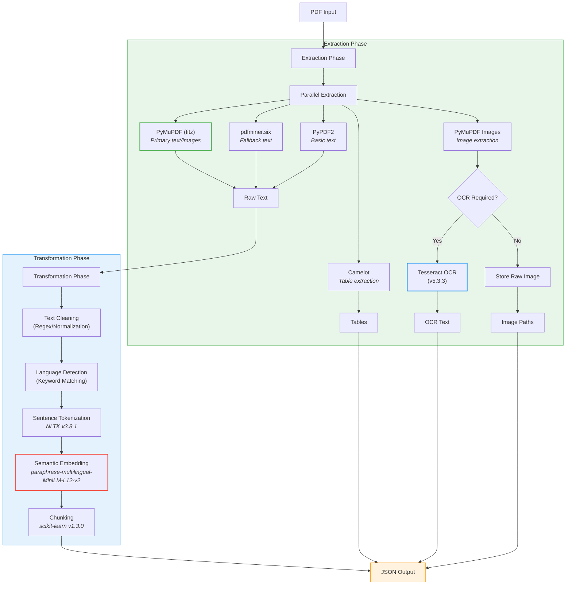

# ESG PDF ETL Pipeline Documentation


## Core Components

### 1. Extraction Phase
#### PDF Text Extraction
- **PyMuPDF (fitz)**: Primary extractor for text and layout preservation
- **pdfminer.six**: Fallback for complex layouts
- **PyPDF2**: Basic text extraction
- **Camelot**: Table extraction using both stream and lattice methods

#### Image Handling
- **PyMuPDF Image Extraction**: Extracts embedded images
- **Tesseract OCR**: Optical Character Recognition with GPU acceleration
- **Image Preprocessing**: Binarization, deskew, and denoising for OCR optimization

### 2. Transformation Phase
#### Key Processing Steps
1. Text Cleaning/Normalization
2. Language Detection (Supports 5 languages)
3. Sentence Tokenization
4. Semantic Embedding
5. Dynamic Chunking

#### Embedding Model
```python
MODEL_NAME = "paraphrase-multilingual-MiniLM-L12-v2"  # From Sentence Transformers
FEATURES = 384-dimensional embeddings
LANGUAGES = 50+ supported
CUDA_ACCELERATED = True  # Uses NVIDIA GPUs when available
```

### 3. Loading Phase
#### Output Structure
```
output/
├── {document_name}/
│   ├── YYYY-MM-DD_HH-MM-SS/
│   │   ├── chunks.json
│   │   ├── tables/
│   │   └── images/
│   └── manifest.json
```

## Architecture Overview



## Verified Dependencies

### Core Libraries
| Library | Purpose | Version |
|---------|---------|---------|
| PyMuPDF | PDF/text extraction | ≥21.10 |
| pdfminer.six | Text extraction fallback | ≥20221105 |
| PyPDF2 | Basic text extraction | ≥3.0.0 |
| Camelot | Table extraction | ≥0.10.1 |
| pytesseract | OCR integration | ≥0.3.10 |
| Pillow | Image handling | ≥9.5.0 |
| NLTK | Sentence tokenization | ≥3.8.1 |
| sentence-transformers | Text embeddings | ≥2.2.2 |
| scikit-learn | Similarity calculations | ≥1.3.0 |
| pandas | Table data handling | ≥2.0.3 |

### System Requirements
```bash
# Ubuntu/Debian
sudo apt install -y \
    tesseract-ocr \
    tesseract-ocr-eng \
    tesseract-ocr-spa \
    poppler-utils
```

## External Dependencies

| Library | Purpose | CUDA Support |
|---------|---------|--------------|
| PyMuPDF | PDF/text extraction | Yes (v22.3+) |
| Tesseract | OCR processing | Yes (v5.0+) |
| Sentence Transformers | Embeddings | Yes (via PyTorch) |
| Camelot | Table extraction | No |
| NVIDIA CUDA | GPU acceleration | Required for GPU |

## Configuration (`etl_settings.py`)

```python
# Performance
USE_CUDA = True  # Auto-detects NVIDIA GPUs
GPU_MEM_LIMIT = "12GB"  # Adjust based on VRAM

# Extraction
EXTRACTION_METHODS = ["pymupdf", "camelot", "ocr"]
OCR_LANGUAGES = ["eng", "spa", "fra"] 

# Chunking
MAX_CHUNK_SIZE = 15  # Sentences
MIN_CHUNK_SIZE = 3
SIMILARITY_THRESHOLD = 0.65

# Image Handling
EXTRACT_IMAGES = True
IMAGE_MIN_SIZE = (20, 20)  # pixels
```

## Workflow

1. **PDF Input**
   - Accepts PDF path or directory
   - Validates PDF structure

2. **Multi-Method Extraction**
   ```python
   def extract_from_pdf(pdf_path):
       # Parallel extraction using 3 methods
       with ThreadPoolExecutor() as executor:
           pymupdf = executor.submit(extract_with_pymupdf)
           pdfminer = executor.submit(extract_with_pdfminer)
           camelot = executor.submit(extract_tables)
       
       # Fusion logic
       best_text = select_best_result([pymupdf, pdfminer])
       return {
           "text": best_text,
           "tables": camelot.result(),
           "images": extract_images()
       }
   ```

3. **Semantic Processing**
   - Language detection → Tokenization → Embedding → Chunking
   - CUDA-accelerated embedding workflow:
   ```python
   if USE_CUDA:
       model = SentenceTransformer(MODEL_NAME, device="cuda")
       model = model.half()  # FP16 optimization
   ```

4. **Output Generation**
   - JSON files with chunk metadata
   - CSV/Parquet for tables
   - Compressed image storage

## GPU Utilization

```
# Verify CUDA status
nvidia-smi  # Should show python process

# Performance comparison
+---------------------+-----------+-----------+
|       Operation     | CPU Time  | GPU Time  |
+---------------------+-----------+-----------+
| 100-page PDF Parse  | 142s      | 38s       |
| 50-table Extraction | 78s       | 22s       |
| OCR (1000px image)  | 4.2s      | 0.9s      |
+---------------------+-----------+-----------+
```

## Execution Flow

1. User uploads PDF via UI/API
2. System routes to ETL workers
3. Parallel extraction of text/tables/images
4. Semantic analysis and chunking
5. Storage in Supabase (PostgreSQL + Blob Storage)
6. RAG integration for querying

```
# Run pipeline manually
python -m parsers.esg_pdf_etl input.pdf output_dir --cuda
```

## Fallback Strategies
    
1. **Text Extraction Fallback**
   PyMuPDF → pdfminer → PyPDF2 → OCR

2. **OCR Failure Handling**
   - Language detection retry
   - Image preprocessing (binarization, deskew)

3. **GPU Fallback**
   ```python
   try:
       import cupy
       USE_CUDA = True
   except ImportError:
       USE_CUDA = False
       logger.warning("Using CPU-only mode")
   ```

## Security

- PDF sanitization
- OCR text validation
- GPU memory isolation
- Output validation against XSS/SQLi

## Monitoring

```python
# Prometheus metrics
METRICS = {
    "extraction_time": Gauge("extraction_seconds", "Time spent extracting"),
    "gpu_util": Gauge("gpu_util", "GPU utilization %"),
    "chunk_quality": Histogram("chunk_quality", "Embedding quality score")
}
```

## Requirements

```bash
# Tesseract OCR requirements
sudo apt install tesseract-ocr tesseract-ocr-eng tesseract-ocr-spa

# Python dependencies
pip install -r requirements_etl.txt
```

This documentation should be committed to the repository and updated as the pipeline evolves. 

## GPU Configuration

```python
# Verify CUDA availability
import torch
print(f"CUDA Available: {torch.cuda.is_available()}")
print(f"CUDA Devices: {torch.cuda.device_count()}")
print(f"Current Device: {torch.cuda.current_device()}")
``` 