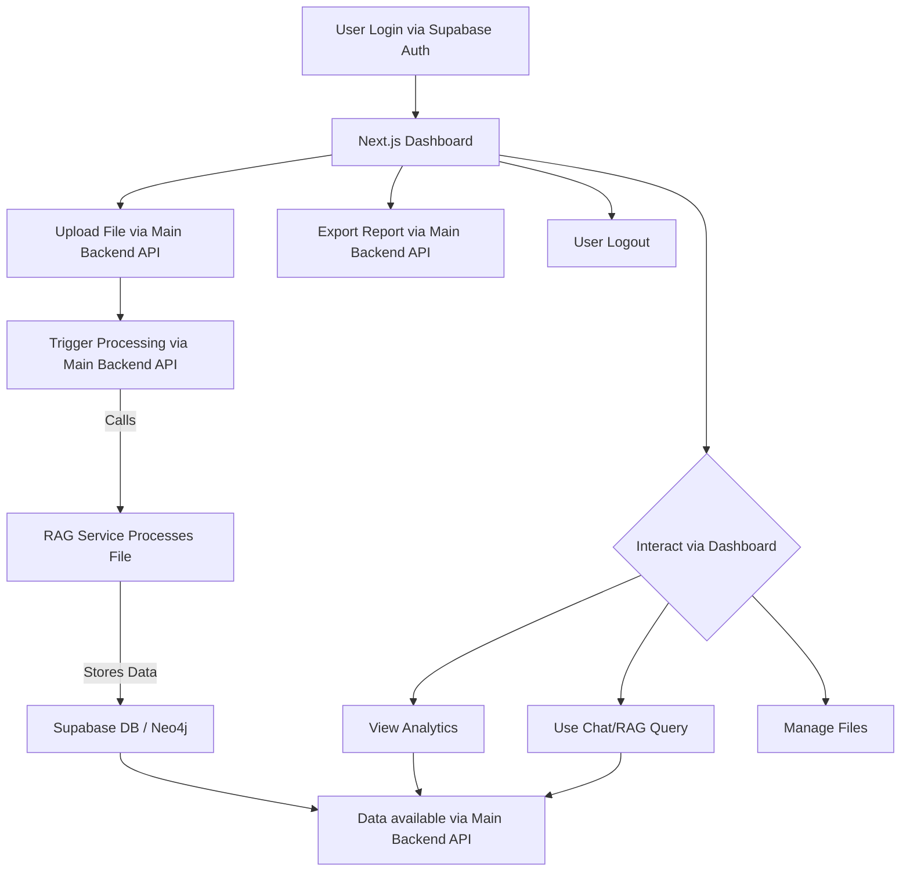
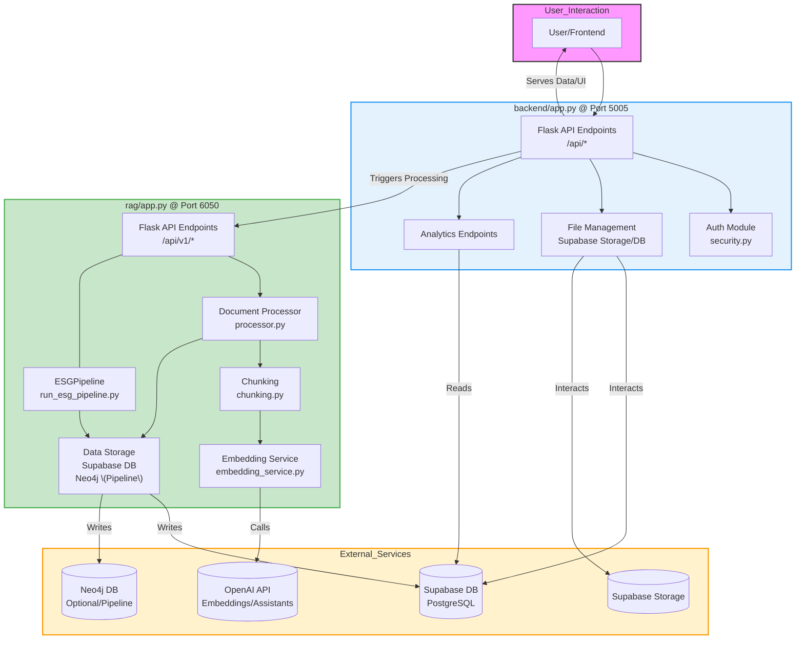

# Product Requirements Document v2.0

**Based on Code Analysis (YYYY-MM-DD)** - *Replace with current date*

## 1. Project Overview

- **Objective:** Develop an AI-powered ESG Data Management & Analytics System that revolutionizes ESG reporting by streamlining the ingestion, processing, analysis, and visualization of ESG-related data using a distributed backend architecture.
- **Goals:**
    - Enable secure upload and storage of diverse file types (PDF, Excel, CSV, DOCX) via a Main Backend API.
    - Process documents using a dedicated RAG microservice leveraging advanced AI techniques (OCR, table parsing, text chunking, OpenAI embeddings) and potentially Neo4j for graph analysis.
    - Provide real-time, interactive visualizations via a Next.js dashboard (consuming backend APIs).
    - Integrate OpenAI-powered features including an Assistants API chat and a RAG-based query capability for natural language interaction with ESG data.
    - Ensure secure user authentication using Supabase Auth and JWT validation, with role-based access control.
- **Intended Outcome:** Empower ESG Managers, Analysts, Executives, and Viewers with actionable insights, reliable reporting, and a user-friendly interface.

---

## 2. Scope

### In-Scope

- **File Upload & Management (Main Backend):**
    - Support for PDF, Excel, CSV, and DOCX uploads with secure storage in Supabase.
    - API endpoints for listing, creating, deleting, and renaming files/folders.
- **Data Processing & Enhancement (RAG Service):**
    - Triggerable processing pipeline for text extraction, chunking, and OpenAI embedding generation.
    - Storage of processed chunks and embeddings in Supabase PostgreSQL (`esg_data.document_chunks`).
    - Advanced pipeline option involving Neo4j graph database population.
    - Implied ETL pipeline for structured data extraction into `esg_data.excel_metrics`.
- **Analytics & Visualization (Frontend consuming Backend APIs):**
    - Real-time dashboard built with Next.js and React for dynamic charting and visualization of ESG data fetched from backend APIs.
- **AI Interaction:**
    - OpenAI Assistants API integration via `/api/chat`.
    - RAG query capability via `/api/rag/query` proxying to the RAG service (requires full implementation).
- **Authentication & Security:**
    - Supabase Auth for user management (e.g., Google OAuth client-side) and JWT validation server-side.
    - Role-based access control and foundational Row-Level Security.
- **Reporting:**
    - Backend API endpoints for triggering and managing report generation.
    - Export functionality (e.g., Excel/PDF) to be implemented based on backend data.
- **Deployment & Monitoring:**
    - Containerized deployment (Docker) on cloud platforms (e.g., Vercel/Cloudflare/AWS) with basic monitoring and scalability provisions.

### Out-of-Scope

- Real-time collaborative editing features.
- Integration with external systems (e.g., ERP, CRM) beyond file uploads.
- Extensive custom AI prompt engineering outside the core RAG/chat context.
- Complex, non-standard ESG framework support beyond initial design.

---

## 3. User Flow

---

## 4. Key Features

- **Secure File Management:**
    - Upload, list, delete, rename functionality for multiple file types via API, stored securely in Supabase.
- **Microservice-Based Data Processing:**
    - Dedicated RAG service handles complex parsing, chunking, embedding, and storage in Supabase DB and Neo4j.
    - Main backend triggers processing, keeping API responsive.
- **Interactive Analytics:**
    - A modern, responsive dashboard (Next.js/React) consumes backend APIs to display visualizations.
- **AI-Powered Interaction:**
    - OpenAI Assistants API chat integration.
    - RAG endpoint for natural language queries against processed documents.
- **Robust Authentication & Security:**
    - Supabase Auth integration with JWT validation and role-based control.
    - Foundation for Row-Level Security in Supabase.
- **Reporting Capabilities:**
    - API endpoints to manage and initiate report generation.

---

## 5. Technology Stack

- **Frontend:** React, Next.js, Tailwind CSS, Recharts (Assumed)
- **Main Backend:** Python, Flask
- **RAG Service:** Python, Flask
- **Database:** PostgreSQL (Supabase Managed)
- **Graph Database:** Neo4j (Self-hosted or Cloud)
- **File Storage:** Supabase Storage
- **AI/ML:** OpenAI API (Embeddings, Assistants, LLMs for RAG)
- **Containerization:** Docker
- **Auth:** Supabase Auth, JWT
- **Deployment:** Cloud Provider (e.g., Vercel, Cloudflare, AWS), GitHub Actions (CI/CD Assumed)

### Architecture Diagram

---

## 6. Non-Functional Requirements

- **Performance:** API response times < 500ms for typical requests. RAG processing time dependent on file size and complexity.
- **Scalability:** Services designed for containerization, allowing horizontal scaling. Target support for initial user load (e.g., 50-100 concurrent users).
- **Security:** JWT validation, HTTPS enforcement, RLS implementation, secure handling of API keys.
- **Usability:** Clear API documentation, intuitive frontend workflows (Responsibility of Frontend Team).
- **Reliability:** Robust error handling in both backend services, reliable external service integrations (Supabase, OpenAI, Neo4j).

---

*This PRD reflects the intended functionality based on the analyzed two-service architecture.*