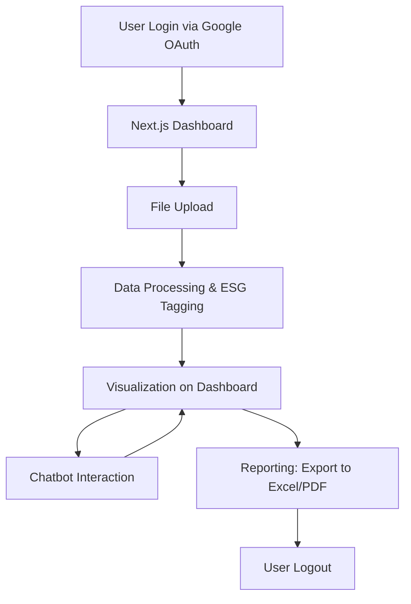
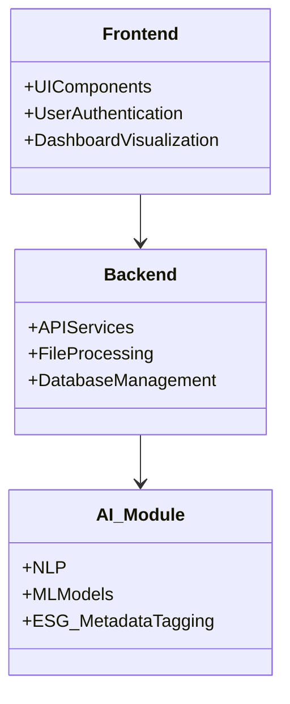
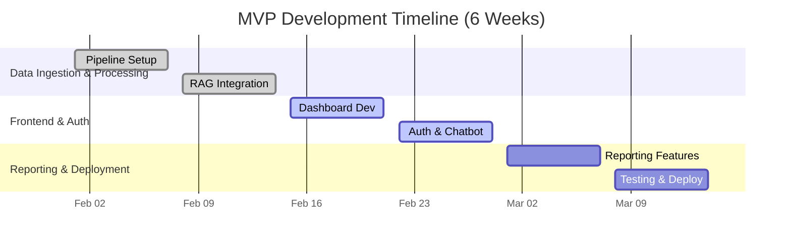

## Project Requirements Document

---

## 1. Project Overview

- **Objective:**Develop an AI-powered ESG Data Management & Analytics System that revolutionizes ESG reporting by streamlining the ingestion, processing, analysis, and visualization of ESG-related data.
- **Goals:**
    - Enable secure upload and storage of diverse file types (PDF, Excel, CSV, DOCX).
    - Process documents using advanced AI techniques (OCR, table parsing, text chunking, and OpenAI embeddings) with ESG metadata tagging.
    - Provide real-time, interactive visualizations via a Next.js dashboard.
    - Integrate a OpenAI-powered chatbot for natural language queries on ESG data.
    - Ensure secure user authentication using Google OAuth via Supabase Auth with row-level security.
- **Intended Outcome:**Empower ESG Managers, Analysts, Executives, and Viewers with actionable insights, reliable reporting, and a user-friendly interface—leveraging existing Simba Assistant and SaaS Factory components for rapid MVP delivery.

---

## 2. Scope

### In-Scope

- **File Upload & Data Ingestion:**
    - Support for PDF, Excel, CSV, and DOCX uploads with secure storage in Supabase.
- **Data Processing & Enhancement:**
    - Text extraction (including OCR for complex PDFs) and table parsing.
    - Dual data pipeline to handle both structured ESG metrics and unstructured detailed chunks with ESG metadata tagging.
- **Analytics & Visualization:**
    - Real-time dashboard built with Next.js and React for dynamic charting and visualization of ESG data.
- **Chatbot Integration:**
    - OpenAI-powered chatbot accessible via a dedicated `/rag-query` endpoint for context-aware ESG queries.
- **Authentication & Security:**
    - Google OAuth-based login via Supabase Auth coupled with robust row-level security.
- **Reporting:**
    - Exportable reports in Excel and PDF formats utilizing tools like Pandas, WeasyPrint, and openpyxl.
- **Deployment & Monitoring:**
    - Deployment on cloud platforms (Vercel/AWS) with basic monitoring and scalability provisions.

### Out-of-Scope

- Advanced analytics beyond standard trend detection and anomaly alerts.
- Integration with external systems (e.g., ERP, CRM) not directly related to ESG data.
- Extensive custom AI prompt engineering outside the ESG context.
- Heavy custom branding beyond the established clean and professional UI design.

---

## 3. User Flow

---

## 4. Key Features

- **Secure File Ingestion:**
    - Upload support for multiple file types with storage in Supabase.
- **Dual Data Processing Pipeline:**
    - Separation of core ESG metrics and detailed data chunks, enriched via advanced text extraction (OCR, table parsing) and ESG metadata tagging.
- **Interactive Analytics:**
    - A modern, responsive dashboard with dynamic visualizations (charts, graphs) powered by React and Recharts.
- **AI-Powered Chatbot:**
    - Integration of a chatbot endpoint (`/rag-query`) to facilitate natural language queries on ESG data.
- **Robust Authentication & Security:**
    - Implementation of Google OAuth and row-level security to ensure data privacy and secure access.
- **Reporting Capabilities:**
    - Generation of exportable reports in PDF and Excel formats using Pandas, WeasyPrint, and openpyxl.
- **Modular Integration:**
    - Leverages existing Simba Assistant and SaaS Factory components with additional enhancements for ESG-specific functionality.

---

## 5. Technology Stack

- **Frontend:** React, Next.js, Tailwind CSS, Recharts
- **Backend:** Python with Flask, PostgreSQL (Supabase), Supabase Storage
- **AI/ML:** OpenAI embeddings, Tesseract OCR, Camelot for table extraction
- **Auth & Security:** Supabase Auth (Google OAuth), AES-256 encryption, TLS 1.2
- **Deployment:** GitHub Actions (CI/CD), Vercel/AWS

---

## 6. Non-Functional Requirements

- **Performance:** Small files ≤ 5s; large files ≤ 30s processing time.
- **Scalability:** Supports up to 500 concurrent users; 99.9% uptime.
- **Security:** AES-256 encryption, TLS 1.2, robust audit trails.
- **Usability:** Clean UI, intuitive chatbot interaction.
- **Reliability:** Async processing, error handling, API retry logic

