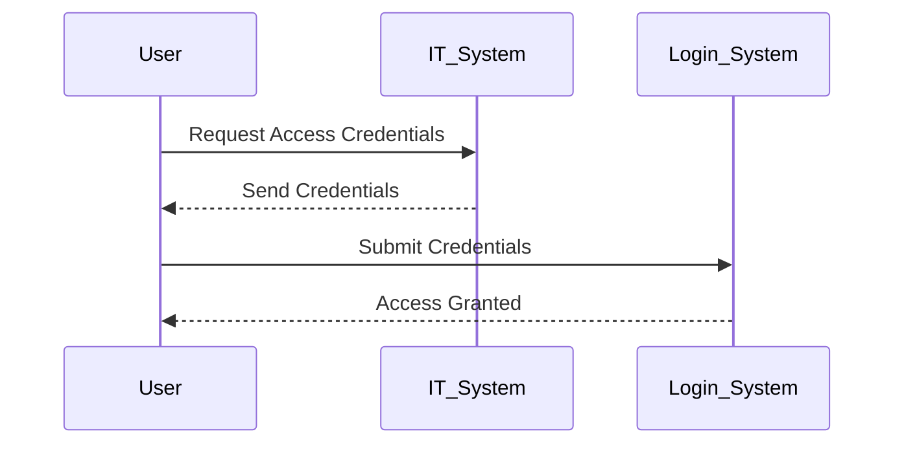
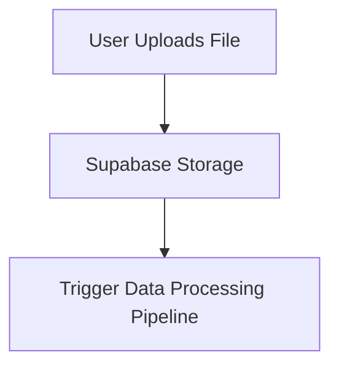
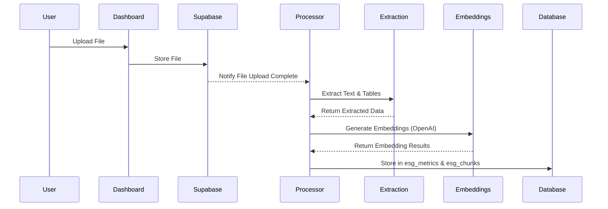
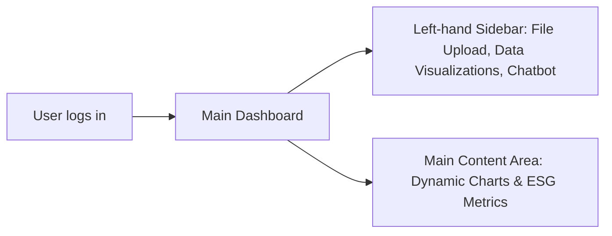
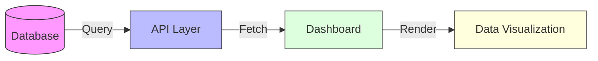
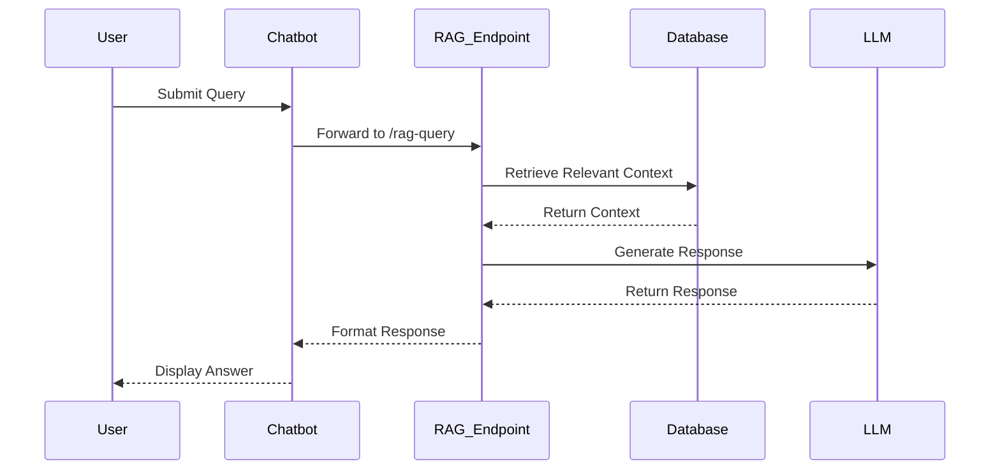
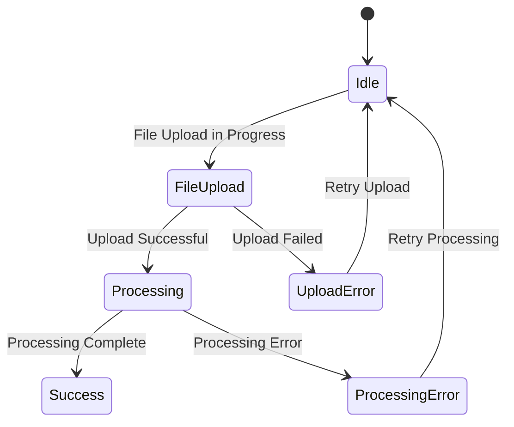
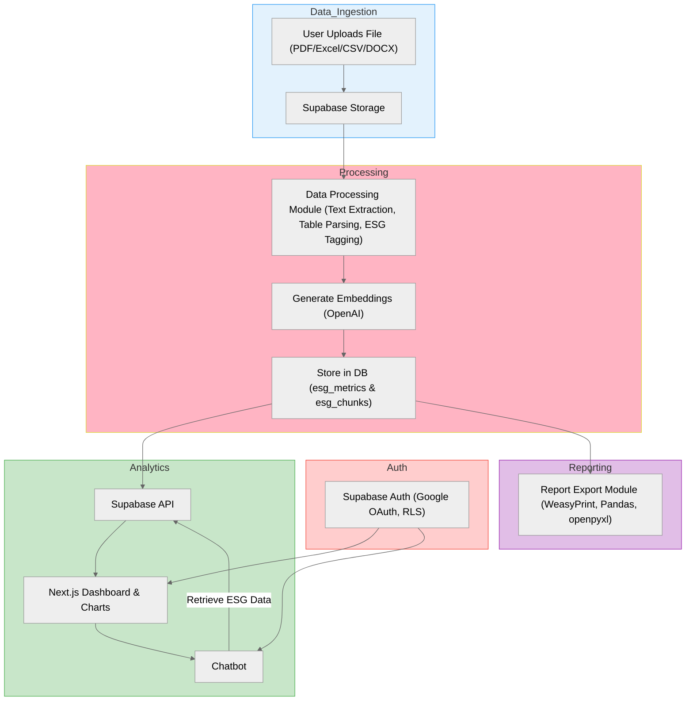

## General Description

- **Purpose & Objectives**
    
    This application is an AI-powered ESG data management and analytics system designed to streamline the reporting and analysis of sustainability data. Its primary objective is to help ESG managers, analysts, decision-makers, and viewers efficiently upload, process, analyze, and report on ESG data.
    
- **Key Benefits**
    - Automated data extraction with ESG metadata tagging
    - Context-aware query responses using retrieval-augmented generation (RAG)
    - Secure user authentication via Google OAuth managed by Supabase Auth with row-level security
    - Interactive dashboard visualization and comprehensive reporting features
    - Scalable and GDPR-compliant platform

---

## User Registration

- **Access, Authentication, and Credential Management**
New users are greeted with a clean login page and can sign in using **Google OAuth**. The authentication is managed securely by **Supabase Auth**, ensuring that only authorized users gain access. Row-level security (RLS) further protects sensitive ESG data.

---

## File Upload and Data Ingestion

- **File Upload Process**
    - Users upload ESG reporting files (PDF, Excel, CSV, DOCX) through the dashboard interface.
    - Files are securely stored in **Supabase Storage**.
- **System Interaction**
    
    The file upload triggers a notification that initiates the data processing pipeline.
    

---

## Data Processing and Storage

- **Processing Workflow**
    - **Text and Table Extraction:**
    Utilizes tools such as **PyPDF2** and **Tesseract OCR** for text extraction, and **Camelot** for table parsing.
    - **Data Chunking & ESG Tagging:**
    Extracted text is segmented into chunks and enhanced with ESG metadata tags.
    - **Embedding Generation:**
    OpenAI is used to generate embeddings for the processed data chunks.
- **Storage**
    
    Processed data is stored in two tables:
    
    - **esg_metrics:** Core ESG data
    - **esg_chunks:** Detailed data pieces

---

## Main Dashboard or Home Page

After signing in, users are directed to the **main dashboard**, which serves as the central hub for the application. The dashboard includes:

- A **left-hand sidebar** with navigation options for file uploads, data visualizations, and chatbot interactions.
- A **main content area** displaying dynamic charts and ESG metrics derived from uploaded documents.

This overview provides immediate insights into sustainability data trends and allows users to easily navigate to specific workflows, such as file processing, report generation, or chatbot queries.

---

## Dashboard and Analytics

- **Dashboard Overview**
The enriched data appears on the dashboard after processing. The dashboard is built using **Next.js**, **React**, and **Recharts**. Data is securely fetched from the database via the **Supabase API** and updated in real time.

---

## Chatbot Interaction

- **User Interaction**
Users can interact with the chatbot via the `/rag-query` endpoint.
The chatbot processes natural language queries and returns context-aware, ESG-specific responses using RAG technology.

---

## Reporting

- **Report Generation**
    - Users can export ESG data into Excel or PDF formats.
    - Report generation leverages **Pandas** for data manipulation, **WeasyPrint** for PDF exports, and **openpyxl** for Excel file creation.

---

## Error Handling and Alternate Paths

- **Error Scenarios**
    - **File Upload Errors:** Clear error messages prompt users to re-upload valid files.
    - **Processing Errors:** Users are notified of processing issues, and error logs are generated for troubleshooting.
    - **Connectivity Issues:** A fallback page informs users that processing will resume once connectivity is restored.

---

## System Architecture

- **Components and Interactions**
    - **Data_Ingestion:** Handles file uploads and storage (Supabase Storage).
    - **Processing:** Manages data extraction, parsing, ESG metadata tagging, and embedding generation.
    - **Analytics:** Provides data retrieval (Supabase API) and dynamic dashboard visualizations.
    - **Auth:** Manages secure user authentication via Google OAuth and enforces row-level security (RLS).
    - **Reporting:** Supports data export in PDF and Excel formats.

--- 

This updated documentation now includes the "Main Dashboard or Home Page" section exactly as provided, preserving the original language and formatting.