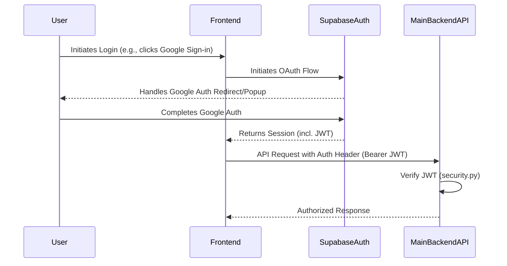
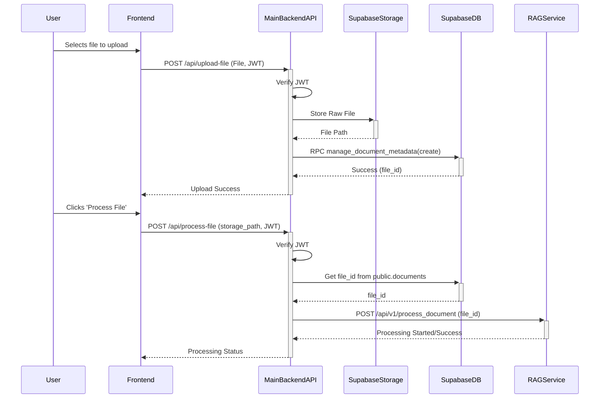
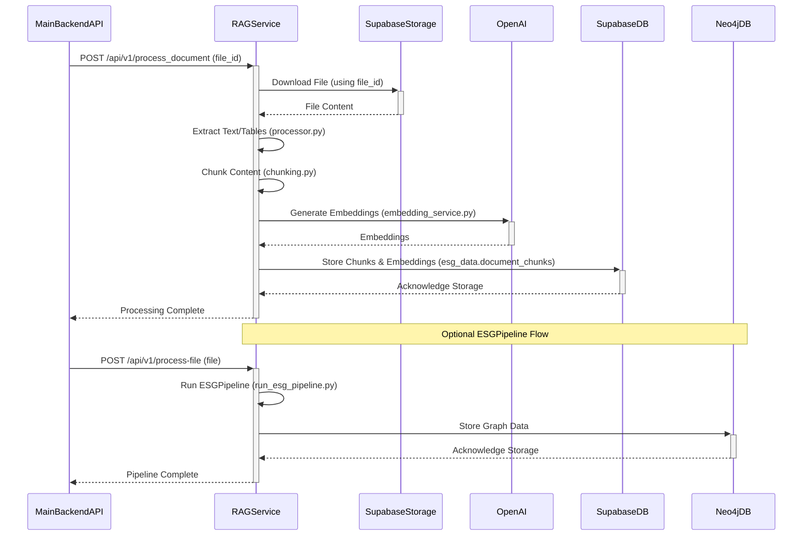
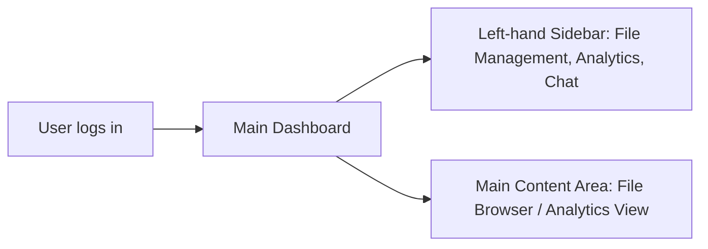
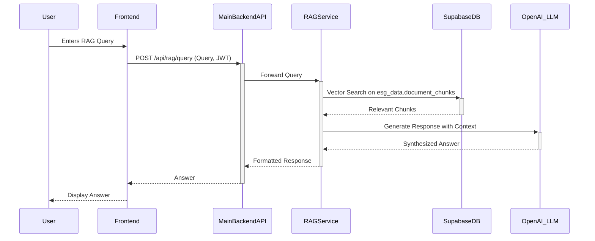
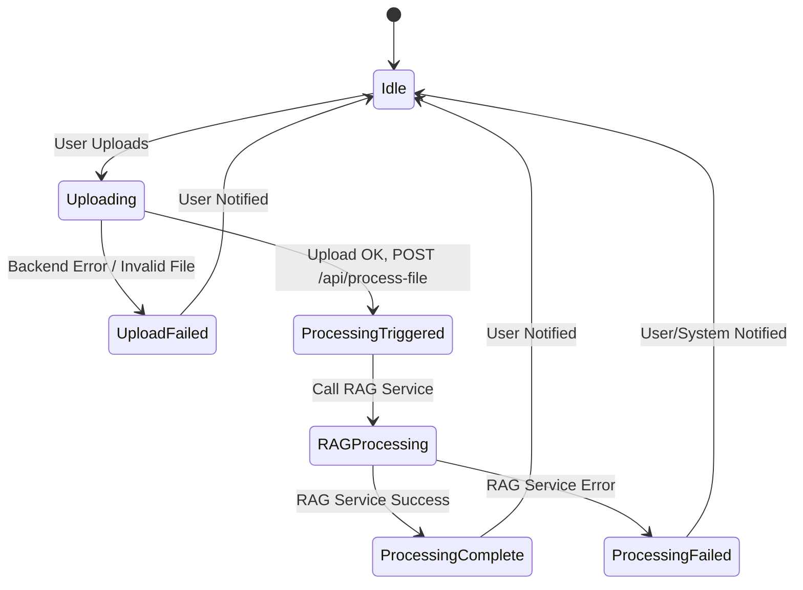
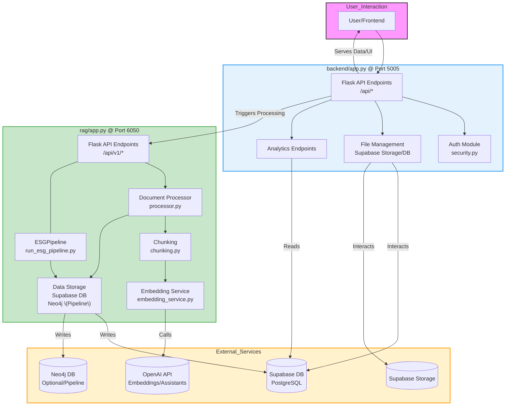

# Application Flow Document v2.0

**Based on Code Analysis (YYYY-MM-DD)** - *Replace with current date*

## General Description

- **Purpose & Objectives**
    
    This application is an AI-powered ESG data management and analytics system designed to streamline the reporting and analysis of sustainability data. Its primary objective is to help ESG managers, analysts, decision-makers, and viewers efficiently upload, process, analyze, and report on ESG data using a distributed backend architecture.
    
- **Key Benefits**
    - Automated data extraction and processing via dedicated microservice.
    - Context-aware query responses using retrieval-augmented generation (RAG).
    - Secure user authentication via Supabase Auth and JWT validation.
    - Role-based access control and potential for Row-Level Security.
    - Interactive dashboard visualization and reporting features via API.
    - Scalable architecture using containerized services.

---

## User Registration & Login

- **Access, Authentication, and Credential Management**
    Users interact with the frontend to sign in, likely using **Supabase Auth** client-side libraries which can handle providers like **Google OAuth**. Upon successful authentication, the frontend receives a JWT. Subsequent requests to the Main Backend API include this JWT as a Bearer token for authentication and authorization.



---

## File Upload and Processing Trigger

- **File Upload Process (Main Backend)**
    - Users upload ESG reporting files (PDF, Excel, CSV, DOCX) through the frontend interface.
    - The frontend sends the file to the Main Backend API (`POST /api/upload-file`).
    - The Main Backend verifies authentication, stores the raw file securely in **Supabase Storage** (`documents` bucket), and records metadata in the `public.documents` table via an RPC call.
- **Processing Trigger (Main Backend -> RAG Service)**
    - The user (via the frontend) triggers processing for an uploaded file, calling the Main Backend API (`POST /api/process-file`) with the file's storage path.
    - The Main Backend retrieves the file's internal ID (`document_id`) from `public.documents`.
    - The Main Backend then makes an API call to the separate **RAG Service** (`POST /api/v1/process_document`), passing the `document_id` to initiate processing.



---

## Data Processing and Storage (RAG Service)

- **Processing Workflow (RAG Service)**
    - Upon receiving a request from the Main Backend, the RAG Service retrieves the corresponding file from Supabase Storage.
    - **Text and Table Extraction:** Uses internal processors (`rag/processor.py`, potentially leveraging libraries like PyMuPDF, python-docx, pandas) to extract content.
    - **Data Chunking:** Extracted content is segmented into meaningful chunks (`rag/chunking.py`).
    - **Embedding Generation:** OpenAI API is called via `rag/embedding_service.py` to generate vector embeddings for each chunk.
    - **(Advanced Pipeline):** An alternative endpoint (`/api/v1/process-file`) triggers `rag/run_esg_pipeline.py` which includes steps for entity/claim extraction and populating a **Neo4j graph database**.
- **Storage (RAG Service)**
    - Processed chunks and their embeddings are stored in the **Supabase PostgreSQL** database, specifically the `esg_data.document_chunks` table.
    - If the advanced pipeline runs, data is also structured and stored in **Neo4j**.



---

## Main Dashboard or Home Page

After signing in, users are directed to the **main dashboard**, which serves as the central hub for the application. The dashboard includes:

- A **left-hand sidebar** with navigation options for file management, data visualizations, and chatbot interactions.
- A **main content area** potentially displaying dynamic charts and ESG metrics derived from processed documents (requires implementation of corresponding analytics APIs).

This overview provides access to file management workflows and allows users to navigate to specific features like analytics (once fully implemented) or chatbot queries.



---

## Dashboard and Analytics

- **Dashboard Overview**
    The dashboard, likely built using **Next.js** and **React**, fetches data from the Main Backend API. While many analytics endpoints exist (`/api/analytics/*`), currently only endpoints for retrieving document chunks (`/api/analytics/data-chunks`) and extracted Excel data (`/api/analytics/excel-data`) provide real data. Other endpoints for aggregated metrics, trends, benchmarks, and reports require further implementation in the backend to process and serve data from Supabase DB or Neo4j.

```mermaid
flowchart LR
    A[(SupabaseDB)] -->|Data| B[Main Backend API
/api/analytics/*]
    B -->|Fetches Data| C[Frontend Dashboard]
    C -->|Renders| D[Data Visualization
(Charts, Tables)]

    style A fill:#ccf,stroke:#333
    style B fill:#e3f2fd,stroke:#2196f3
    style C fill:#dfd,stroke:#333
    style D fill:#ffd,stroke:#333
```

---

## Chatbot Interaction

- **User Interaction**
    - **Assistants API Chat**: Users can interact with a general-purpose assistant via the Main Backend's `/api/chat` endpoint, which uses the OpenAI Assistants API.
    - **RAG Query (Intended)**: The `/api/rag/query` endpoint in the Main Backend is intended to proxy natural language queries to the RAG Service. The RAG service would then perform a semantic search over the embeddings stored in `esg_data.document_chunks`, retrieve relevant context, potentially synthesize an answer using an LLM (like OpenAI), and return the ESG-specific response.



---

## Reporting

- **Report Generation**
    - API endpoints exist in the Main Backend (`/api/analytics/generate-report`, `/api/analytics/report-status`, `/api/analytics/reports`) for managing report generation.
    - The actual implementation of generating reports (e.g., PDF/Excel using libraries like Pandas, WeasyPrint, openpyxl) based on data from Supabase/Neo4j needs to be completed within the backend.

```mermaid
flowchart LR
  A[Processed ESG Data
(SupabaseDB / Neo4j)] --> B[Main Backend API
Report Generation Logic]
  B --> C[Export as PDF/Excel]
```

---

## Error Handling and Alternate Paths

- **Error Scenarios**
    - **File Upload Errors:** Main Backend API returns errors for invalid file types or missing authentication.
    - **Processing Errors:** RAG Service or Main Backend logs errors during processing. Frontend should display appropriate messages.
    - **Connectivity Issues:** Errors between Main Backend and RAG Service, or between services and external APIs (Supabase, OpenAI, Neo4j) need to be handled gracefully (e.g., retries, status updates).



---

## System Architecture (Updated)

- **Components and Interactions**
    - **User/Frontend**: Interacts with the Main Backend API.
    - **Main Backend API (Flask)**: Handles auth, file management, triggers RAG, serves analytics data (partially implemented), proxies RAG queries (intended), handles chat.
    - **RAG Service (Flask)**: Handles document processing (chunking, embedding), stores results in Supabase/Neo4j.
    - **Supabase**: Provides PostgreSQL DB, file storage, and authentication services.
    - **OpenAI**: Provides APIs for embeddings and chat models.
    - **Neo4j**: Provides graph database capabilities for advanced pipeline.



---

*This document describes the application flow based on the current two-service architecture analysis.*