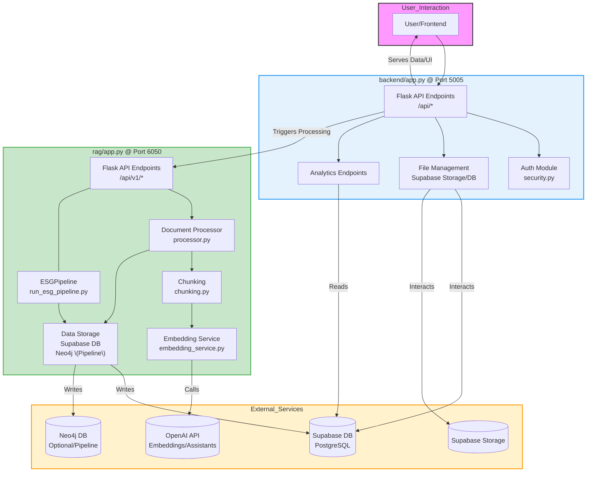
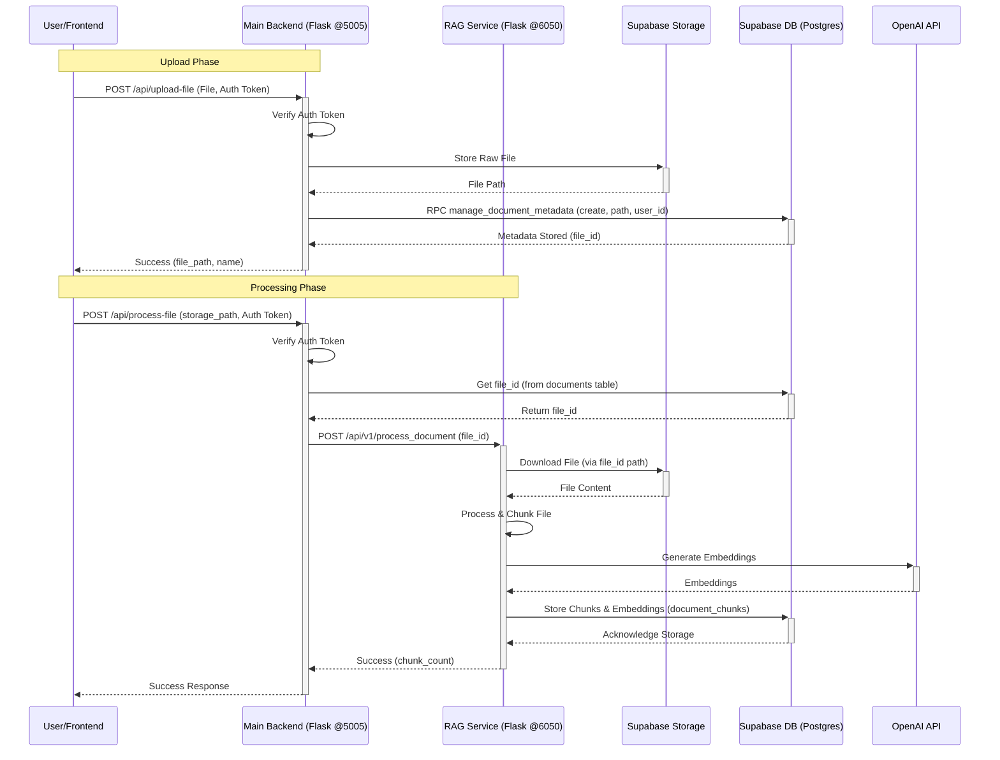

# Backend Structure Document v2.0

**Based on Code Analysis (YYYY-MM-DD)** - *Replace with current date*

This document outlines the backend architecture for the **AI-Powered ESG Data Management & Analytics System**, updated based on codebase analysis. It details system objectives, the actual two-service architecture, data flow, database usage, and security measures.

---

## 1. Introduction

- **Objectives**:
    - Ingest uploaded ESG files (PDF, Excel, CSV, DOCX) via the main backend.
    - Trigger processing via a dedicated RAG microservice.
    - Normalize data, generate embeddings (via RAG service using OpenAI), and store results in Supabase PostgreSQL and potentially Neo4j.
    - Provide APIs for file management, triggering processing, and retrieving processed data.
    - Enable secure access through Supabase Auth (details depend on frontend implementation, backend uses JWT).
- **Core Functionalities**:
    - **Data Ingestion (Main Backend)**: Securely upload files to Supabase Storage and record metadata in `public.documents`.
    - **Data Processing Trigger (Main Backend)**: API endpoint (`/api/process-file`) to trigger processing of an uploaded file by the RAG service.
    - **Core RAG Processing (RAG Service)**:
        - Extracts text and chunks documents.
        - Generates embeddings using OpenAI (`text-embedding-3-small` or similar).
        - Stores text chunks and embeddings in Supabase PostgreSQL (`esg_data.document_chunks`).
        - **(Advanced Pipeline)**: An alternative pipeline (`ESGPipeline`) exists within the RAG service to process files and potentially populate a **Neo4j graph database**.
    - **Structured Data ETL (Implied)**: Presence of `esg_data.excel_metrics` table and `etl_*` directories suggests separate ETL processes for structured data, likely triggered manually or via endpoints (`/api/trigger-etl`).
    - **Data Storage**:
        - **Supabase PostgreSQL**:
            - `public.documents`: Stores metadata about uploaded files/folders.
            - `esg_data.document_chunks`: Stores text chunks and embeddings from RAG processing.
            - `esg_data.excel_metrics`: Stores structured data extracted from Excel/CSV (via ETL).
        - **Supabase Storage**: Stores the raw uploaded files (`documents` bucket).
        - **Neo4j (via RAG Service Pipeline)**: Used for graph-based data representation in the advanced `ESGPipeline`.
    - **Analytics & Reporting**: Provides API endpoints for metrics, chunks, trends, benchmarks, and report generation/status (`/api/analytics/*`). Real data access is implemented for listing chunks (`/api/analytics/data-chunks`) and Excel data (`/api/analytics/excel-data`).
    - **RAG Querying**: An endpoint (`/api/rag/query`) exists, presumably to proxy natural language queries to the RAG service for searching through `esg_data.document_chunks`.
    - **Chat**: An endpoint (`/api/chat`) interacts with the OpenAI Assistants API.
    - **Security**: Implements JWT-based authentication (`@require_auth`) and role-based access control (`@require_role`) using decorators in `security.py`. Relies on Supabase Auth for user management and potentially RLS (example policies provided).
- **Role in Overall Application**:
    Provides the core API for file management, triggers data processing via a microservice, stores processed data, and exposes endpoints for analytics and reporting.

---

## 2. System Architecture: Two-Service Model

The backend consists of two primary services:

1.  **Main Backend API (Flask)**: Located in `backend/`. Handles user-facing API requests, authentication, file management interacting directly with Supabase Storage and the `public.documents` table, and triggers processing by calling the RAG Service. Exposes analytics endpoints.
2.  **RAG Service (Flask)**: Located in `rag/`. A separate microservice responsible for the heavy lifting of document processing. It receives files/triggers from the Main Backend, performs parsing, chunking, embedding generation (calling OpenAI), and stores results in Supabase (`esg_data.document_chunks`). It also contains an advanced pipeline potentially interacting with Neo4j.

### High-Level Architecture Diagram

---

## 3. Database Management

- **Primary Database Engine**: **Supabase PostgreSQL**
- **Key Tables Identified**:
    - `public.documents`: Stores metadata for uploaded files and folders (name, path, type, size, user_id, timestamps). Managed by the Main Backend via the `manage_document_metadata` RPC function.
    - `esg_data.document_chunks`: Stores text chunks resulting from RAG processing, along with their embeddings and metadata (document_id, chunk_type, etc.). Populated by the RAG Service.
    - `esg_data.excel_metrics`: Appears to store structured data extracted from Excel/CSV files (metric names, values, units, year, quarter). Likely populated by a separate ETL process.
    - (Implicit): Tables related to users and potentially organizations for RLS (`user_organizations` mentioned in RLS examples).
- **Raw File Storage**: **Supabase Storage** (`documents` bucket).
- **Graph Database (via RAG Service)**: **Neo4j** is used within the `ESGPipeline` of the RAG service for advanced graph-based analysis, populated via `run_esg_pipeline.py`.

---

## 4. API Design and Endpoints

### Main Backend API (`backend/app.py`)

- **RESTful API Approach**: Provides endpoints for file management, auth, triggering processing, and analytics.
- **Key Endpoints**:
    - **File Management**:
        - `POST /api/upload-file`: Handles file uploads to Supabase Storage and `public.documents`.
        - `POST /api/create-folder`: Creates folders in Supabase Storage and `public.documents`.
        - `GET /api/list-tree`: Lists files/folders from Supabase Storage.
        - `DELETE /api/delete`: Deletes files/folders from Storage and `public.documents`.
        - `POST /api/rename`: Renames files/folders in Storage and `public.documents`.
        - `GET /api/files/<file_id>/download`: Gets a signed URL for downloading a file.
        - `GET /api/search-files`: Performs simple filename-based search in Storage.
    - **Processing Trigger**:
        - `POST /api/process-file`: **Triggers the RAG Service** (`/api/v1/process_document`) to process a file previously uploaded to Supabase Storage.
    - **Authentication/User**:
        - `GET /api/profile`: Gets authenticated user details from JWT.
        - (Assumed Login endpoint handled by Supabase Auth client-side)
    - **Analytics**:
        - `GET /api/analytics/metrics`: Retrieves aggregated ESG metrics.
        - `GET /api/analytics/data-chunks`: Lists processed chunks for a document (from `esg_data.document_chunks`).
        - `GET /api/analytics/data-chunks/<chunk_id>`: Retrieves chart data for a chunk.
        - `GET /api/analytics/reports`: Fetches a list of generated reports.
        - `GET /api/analytics/trends`: Retrieves ESG metric trends over time.
        - `GET /api/analytics/benchmarks`: Gets industry benchmarks and comparisons.
        - `POST /api/analytics/generate-report`: Initiates ESG report generation.
        - `GET /api/analytics/report-status/<report_id>`: Gets the status of a report generation process.
        - `GET /api/analytics/excel-data`: Gets structured data from `esg_data.excel_metrics`.
        - `GET /api/analytics/excel-files`: Lists processed Excel files from `public.documents`.
    - **RAG/Chat**:
        - `POST /api/rag/query`: (Implementation unclear) Intended proxy for RAG queries to the RAG service.
        - `POST /api/chat`: Interacts with OpenAI Assistants API.
    - **ETL**:
        - `GET /api/etl-status`: Retrieves the status of ETL processes.
        - `POST /api/trigger-etl`: Triggers an ETL process.

### RAG Service (`rag/app.py`)
    
- **Key Endpoints**:
    - `POST /api/v1/process_document`: Receives file content and `file_id` from Main Backend, performs chunking, embedding (via OpenAI), and stores results in `esg_data.document_chunks`.
    - `POST /api/v1/process-file`: Receives a file, runs the full `ESGPipeline`, potentially populating Neo4j.
    - (Assumed: An endpoint for handling RAG queries, possibly `/api/v1/query` - needs verification).

---

## 5. Hosting Solutions & Infrastructure Components

- **Containerization**: Both the Main Backend and RAG Service have `Dockerfile`s, indicating they are designed to be run as **Docker** containers.
- **Hosting (Likely)**:
    - **Main Backend & RAG Service**: Deployed on Cloudflare or similar cloud providers using Docker containers.
    - **Database & Storage**: Managed by **Supabase** (PostgreSQL + File Storage).
    - **Graph Database**: Requires a separate **Neo4j** instance (cloud-hosted or self-managed).
    - **Frontend**: Hosted on **Vercel** (as per original doc).
- **Infrastructure Tools**:
    - **Docker** for containerization.
    - **Supabase** for auth, database, and file storage.
    - **OpenAI API** for embeddings and chat.
    - **Neo4j** database instance (required for `ESGPipeline`).
    - **Cloud Provider** (e.g., AWS, Cloudflare) for hosting containers.
    - **Redis** (Optional, mentioned in `/api/chat` for thread management).

---

## 6. Security Measures

- **Authentication & Authorization (Main Backend)**:
    - Relies on client-side interaction with **Supabase Auth** for login/signup (e.g., Google OAuth).
    - Backend validates **JWT** tokens received in the `Authorization: Bearer` header using `security.py`.
        - **Note**: Current implementation in `verify_jwt_token` decodes the token but *does not verify the signature*. Assumes token integrity is handled upstream or implicitly trusted.
    - Role-based access control via `@require_role` decorator, checking `app_metadata.role` in the JWT payload.
- **Row-Level Security (RLS)**:
    - Designed to be implemented in **Supabase PostgreSQL** using `auth.uid()` and potentially organization/user mapping tables.
    - Example policies provided in `security.py` comments.
- **Encryption**:
    - **Data at Rest**: Handled by Supabase for database and storage (typically AES-256).
    - **Data in Transit**: Assumes HTTPS for API communication (standard practice, enforced by hosting/load balancers) and TLS for database connections (handled by Supabase client).
- **Compliance**: Adherence to GDPR depends on correct RLS implementation, data handling practices, and respecting user rights.

---

## 7. Monitoring and Maintenance

- **Logging**: Both services implement logging.
    - Main Backend (`backend/app.py`): Configured with `RotatingFileHandler` to `logs/app.log` and console output.
    - RAG Service (`rag/app.py`): Basic logging configured.
- **Error Tracking**: Sentry mentioned in the original doc, but no integration code seen in `backend/app.py` or `rag/app.py`. Requires external setup.
- **Maintenance**: Standard practices apply (dependency updates, security patching, performance monitoring via hosting provider tools like CloudWatch if on AWS).

---

## 8. Data Flow Diagram (Upload & Basic RAG Processing)

---

## 9. Conclusion

- The backend architecture consists of a **Main Flask API** and a separate **Flask RAG Microservice**.
- It utilizes **Supabase** for authentication, PostgreSQL database (`public.documents`, `esg_data.document_chunks`, `esg_data.excel_metrics`), and file storage.
- **OpenAI** is used for embeddings (via RAG service) and chat (via Main Backend).
- A **Neo4j graph database** is incorporated in an advanced processing pipeline within the RAG service.
- Key functionalities like file management and basic RAG processing triggering are implemented.
- Security relies on JWT validation (currently without signature check) and planned Supabase RLS.

---

*This document reflects the state of the codebase as analyzed. Implementation details should be verified as development progresses.*