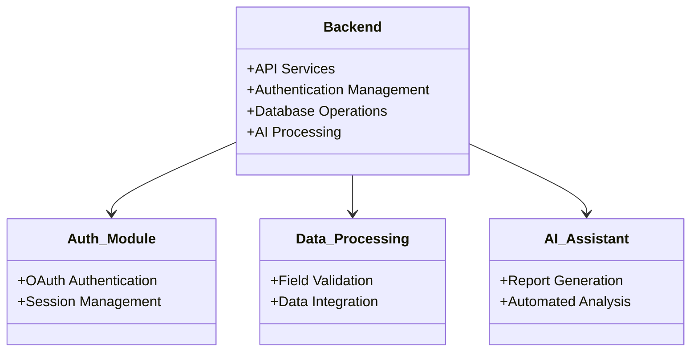
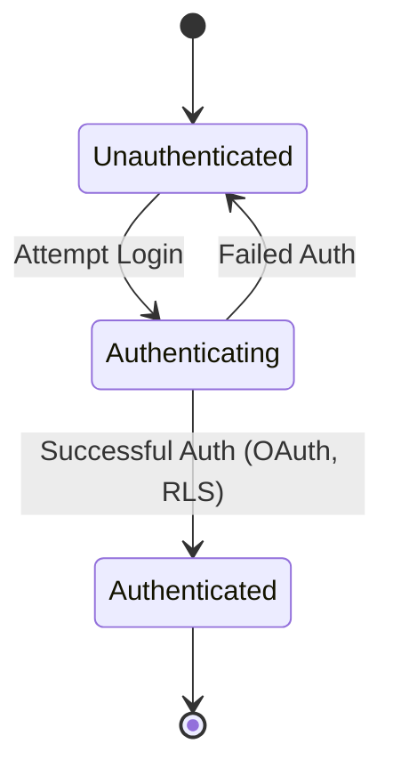
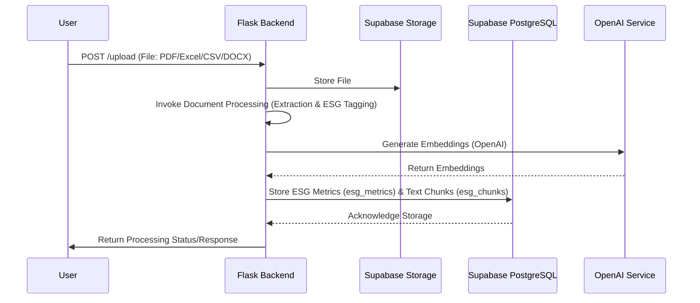
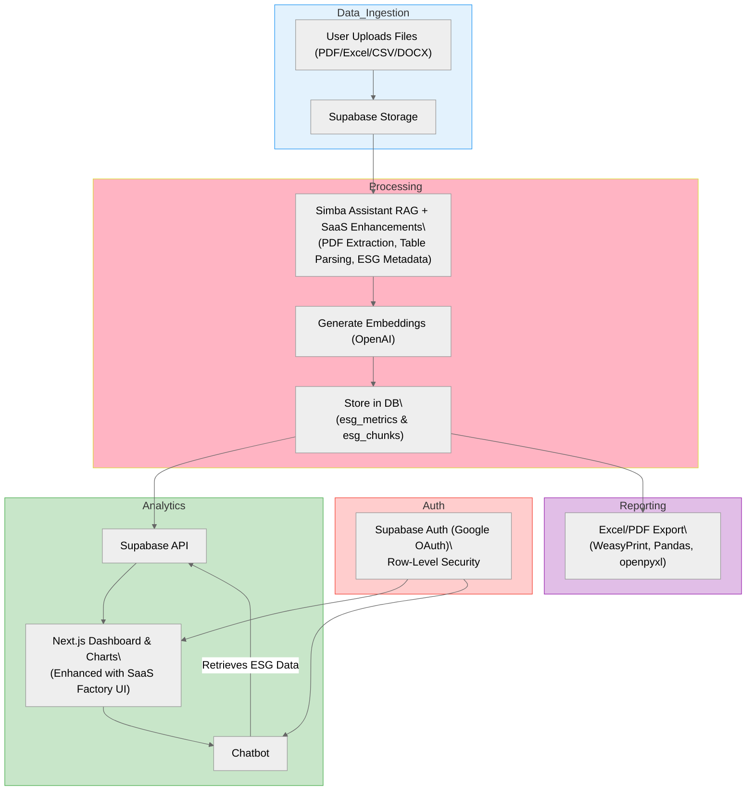

This document outlines the backend architecture for our **AI-Powered ESG Data Management & Analytics System**. It details system objectives, modular design, data flow, security measures, and key MVP enhancements.

---

## 1. Introduction

- **Objectives**:
    - Process uploaded ESG files (PDF, Excel, CSV, DOCX).
    - Normalize and store ESG data for further analysis.
    - Deliver actionable insights via RESTful APIs.
    - Enable secure access through Google OAuth and Supabase Auth.
- **Core Functionalities**:
    - **Data Ingestion**: Securely upload and store diverse file types.
    - **Data Processing**: Extract, transform, and generate embeddings (with OpenAI) for ESG metadata tagging.
    - **Data Storage**: Dual storage using Supabase PostgreSQL for core metrics (`esg_metrics`) and detailed text chunks (`esg_chunks`).
    - **Analytics & Reporting**: Provide ESG dashboards, interactive chatbot integration, and export capabilities (Excel/PDF).
    - **Security**: Implement robust authentication (Google OAuth + Supabase Auth), row-level security, and data encryption (AES-256, TLS 1.2).
- **Role in Overall Application**:
    
    Acts as the backbone for ESG data processing, analysis, and secure delivery of insights to ESG managers, analysts, and stakeholders.
    

---

## 2. Modular Design

The backend is a **modular monolithic application** built using **Flask**. This design simplifies development, deployment, and future scalability while maintaining separation of concerns.

### Key Modules:

- **API Services**: Handles RESTful endpoints for file uploads, data processing, and querying.
- **Authentication Management**: Implements Supabase Auth with Google OAuth and row-level security.
- **Database Operations**: Manages dual storage of ESG metrics and detailed text chunks.
- **AI Processing**: Integrates with OpenAI for generating embeddings and powering the chatbot via RAG technology.

### Modular Architecture Diagram

---

## 3. Database Management

- **Database Engine**: **Supabase PostgreSQL**
- **Dual Storage Strategy**:
    - **esg_metrics**: Stores core ESG metrics (e.g., emissions, energy use).
    - **esg_chunks**: Stores detailed text segments with OpenAI embeddings for advanced searchability.

---

## 4. API Design and Endpoints

- **RESTful API Approach**:
    
    Provides clear, predictable endpoints for communication with the frontend and third-party services.
    
- **Key Endpoints**:
    1. **POST /upload**: Handles file uploads.
    2. **POST /rag-query**: Processes natural language queries via the chatbot.
    3. **GET /metrics**: Retrieves ESG metrics for dashboard visualizations.

---

## 5. Hosting Solutions & Infrastructure Components

- **Containerization**:
    
    The backend is containerized with **Docker** for consistency across development and production environments.
    
- **Hosting**:
    - **Backend**: Deployed on **AWS** (EC2 or Lambda) using Docker containers.
    - **Database**: Managed by **Supabase** (PostgreSQL + file storage).
    - **Frontend**: Hosted on **Vercel**.
- **Infrastructure Tools**:
    - **Docker** for containerization.
    - **AWS** for scalable hosting and monitoring.
    - **Supabase** for authentication, database, and file storage.

---

## 6. Security Measures

Security is integrated at every layer of the backend architecture.

- **Authentication & Authorization**:
    - **Supabase Auth + Google OAuth** for secure login.
    - **Row-Level Security (RLS)** to restrict data access based on user roles.
- **Encryption**:
    - **AES-256** for encrypting data at rest.
    - **TLS 1.2** for securing data in transit.
- **Compliance**:
    - Adheres to **GDPR** for data privacy and security.

### Security State Diagram

---

## 7. Monitoring and Maintenance

- **Logging & Monitoring**:
    - **Supabase Logs**: Monitors database and authentication events.
    - **AWS CloudWatch**: Tracks backend performance and errors.
- **Error Tracking**:
    - **Sentry**: Captures real-time error reports.
- **Maintenance**:
    - Regular updates to dependencies.
    - Continuous performance optimizations and security patching.

---

## 8. Lean MVP Plan (v1.2) Overview

### MVP Features (Must-Have)

| **Category** | **Features to Include** | **Why?** | **Tools/Components (with Modifications)** |
| --- | --- | --- | --- |
| **Data Ingestion** | - File uploads (PDF/Excel/CSV/DOCX) - Dual pipeline for structured & unstructured data | Handle multiple file types with ESG metadata tagging | **Simba:** Next.js UI, Supabase Storage, `document_processor.py` (extended for ESG metadata) **SaaS Factory:** EnhancedDocumentProcessor (OCR/table extraction) |
| **Basic Processing** | - Text extraction and chunking with ESG tags - OpenAI embeddings generation | Transform raw files into searchable, ESG-tagged data | **Simba:** `embedding_service.py` & chunking functions (with ESG metadata) **SaaS Factory:** Tesseract OCR & Camelot for non-PDF content processing |
| **User Interface** | - Dashboard with ESG metrics and visualizations - chatbot integration | Interactive insights and data visualization | **Simba:** Next.js dashboard (updated for ESG metrics) **SaaS Factory:** Chart components, DocumentUploader UI |
| **Auth & Security** | - Google OAuth login/signup - Row-level security for ESG data | Secure access and data privacy | **Simba:** Supabase Auth (Google OAuth) with enhanced RLS **SaaS Factory:** (Optional integration with Firebase/Supabase Auth) |
| **Output Generation** | - Export reports in Excel/PDF - Reporting from dual-stored ESG data | Enable offline report generation | **Simba:** Extended dual storage & reporting modules **SaaS Factory:** Adapted reporting components (Pandas, WeasyPrint, openpyxl) |

### Reusable Components

- **From Simba Assistant**:
    - Core RAG components (document processor, OpenAI embeddings, Supabase vector retriever).
    - Authentication flow (Supabase Google OAuth).
    - Basic processing pipeline (text chunking, vector storage).
- **Combined with SaaS Factory**:
    - Unified file processing (Simba’s PDF processor + SaaS Factory’s Camelot/Tesseract).
    - Enhanced metadata handling (Simba’s basic metadata + SaaS Factory’s config system).
    - Improved visualizations and analytics tailored for ESG.

---

## 9. Data Flow

### Data Processing Sequence

---

## 10. Overall Architecture Diagram (MVP Focus)

---

## 11. Conclusion

- The backend leverages **Flask**, **Supabase**, and **Docker** to provide a secure, scalable, and maintainable architecture.
- The modular monolithic design enables rapid MVP development while supporting future enhancements.
- Through secure authentication, dual data storage, and integration with AI and analytics tools, the system effectively processes and visualizes ESG data, meeting both current and future stakeholder needs.

---

*Note: Any missing specifics (e.g., detailed file parser configurations or additional microservice interactions) are flagged as **[Missing Information]** and should be updated as the project evolves.*