# File Structure Documentation v2.0

**Based on Code Analysis (YYYY-MM-DD)** - *Replace with current date*

## Introduction

A well-structured file system is critical for supporting development, collaboration, and scalability. This document outlines the actual file structure of the ESG Data Management & Analytics System, organizing code, configuration, tests, and documentation to facilitate efficient development and maintenance.

---

## Technology Stack Influence

The project's technology stack significantly shapes its file organization. Key technologies influencing this structure include:

-   **Programming Languages & Frameworks:** Python/Flask (for both the Main Backend API and the RAG Service), JavaScript/TypeScript with Next.js (assumed for Frontend).
-   **Databases & Storage:** Supabase (PostgreSQL DB & File Storage), Neo4j (Graph DB used by RAG service). Requires configuration likely within service directories or `.env` files.
-   **Containerization:** Docker is used, indicated by `Dockerfile`s within service directories (`backend`, `rag`).
-   **AI Services:** OpenAI API integration necessitates API key management (likely via `.env`).
-   **Testing Tools:** Pytest is used for backend/RAG testing, indicated by `tests/` directories and `pytest.ini` files.
-   **Package Management:** `requirements.txt` (Python) and `package.json` (Node.js/Frontend) manage dependencies.
-   **Task Management:** A `tasks/` directory suggests use of a task runner or management system (like Task Master AI).
-   **Documentation:** Markdown files stored in the `documentation/` directory.
-   **CI/CD:** Configuration resides in the `.github/` directory.

---

## Root Directory Structure

The project does not use a single top-level `src/` directory. Instead, core components like frontend, backend, and the RAG service are organized into separate top-level directories.

-   **`backend/`**: Contains the source code for the Main Backend API (Flask service).
    -   `app.py`: Main Flask application file, defining API endpoints.
    -   `security.py`: Handles authentication (JWT) and authorization logic.
    -   `utils/`: Utility functions.
    -   `parsers/`: Specific file parsing logic (potentially used by ETL).
    -   `etl_*` (e.g., `etl_xlsx/`): Directories containing Extract-Transform-Load scripts.
    -   `models/`: Data models (likely SQLAlchemy or Pydantic).
    -   `config/`: Configuration files specific to the backend service.
    -   `tests/`: Pytest tests for the backend service.
    -   `requirements.txt`: Python dependencies for the backend.
    -   `Dockerfile`: Instructions to containerize the backend service.
-   **`frontend/`**: Contains the source code for the Next.js frontend application (structure assumed based on Next.js conventions).
-   **`rag/`**: Contains the source code for the dedicated RAG microservice (Flask service).
    -   `app.py`: Main Flask application file for the RAG service API.
    -   `run_esg_pipeline.py`: Core script for the complex pipeline involving Neo4j.
    -   `processor.py`, `chunking.py`, `embedding_service.py`: Handle core RAG steps.
    -   `parsers/`, `chunkers/`: Supporting modules for processing.
    -   `graph_store.py`, `build_esg_graph.py`, `import_*.py`: Neo4j interaction logic.
    -   `supabase_*.py`: Supabase client/storage interactions.
    -   `tests/`: Pytest tests for the RAG service.
    -   `requirements.txt`: Python dependencies for the RAG service.
    -   `Dockerfile`: Instructions to containerize the RAG service.
-   **`documentation/`**: Contains project documentation files (like this one, PRD, schema design, etc.).
-   **`scripts/`**: Contains utility scripts, potentially for setup, deployment, or maintenance tasks. Includes `task-master-ai` related scripts.
-   **`tasks/`**: Contains generated task files and potentially `tasks.json` for project management using Task Master AI.
-   **`.github/`**: Contains GitHub-specific files, including CI/CD workflows (`workflows/`).
-   **`.venv/`**: Standard Python virtual environment directory (usually excluded from Git).
-   **`node_modules/`**: Standard Node.js dependency directory (usually excluded from Git).
-   **`config/`**: (Potential top-level) May contain shared configuration if present.
-   **`uploads/`**, **`logs/`**: Directories for temporary file uploads and application logs (likely excluded from Git).
-   **Configuration Files**:
    -   `.env*` files (e.g., `.env.local`): Store environment variables (API keys, DB URLs - **should be excluded from Git**).
    -   `package.json`, `package-lock.json`: Node.js project configuration and dependencies.
    -   `requirements.txt`: Top-level Python dependencies (potentially for shared tools or scripts).
    -   `.gitignore`: Specifies intentionally untracked files.
    -   `Dockerfile` (Top-level?): If present, might be for orchestration or a different service.
    -   `.dockerignore`: Specifies files to exclude from Docker images.

### Visual Structure Overview

```mermaid
graph TD;
    Root --- backend;
    Root --- frontend;
    Root --- rag;
    Root --- documentation;
    Root --- scripts;
    Root --- tasks;
    Root --- .github;
    Root --- config((.env*));
    Root --- pkg_json[package.json];
    Root --- req_txt[requirements.txt];
    Root --- gitignore[.gitignore];

    backend --> be_app[app.py];
    backend --> be_sec[security.py];
    backend --> be_etl[etl_*/];
    backend --> be_models[models/];
    backend --> be_tests[tests/];
    backend --> be_req[requirements.txt];
    backend --> be_docker[Dockerfile];

    rag --> rag_app[app.py];
    rag --> rag_pipe[run_esg_pipeline.py];
    rag --> rag_proc[processor.py];
    rag --> rag_graph[graph_store.py/...];
    rag --> rag_tests[tests/];
    rag --> rag_req[requirements.txt];
    rag --> rag_docker[Dockerfile];

    frontend --> fe_code[Next.js Code...];

    style Root fill:#ddd,stroke:#333,stroke-width:2px
```

---

*This document reflects the observed file structure. Specific sub-directory contents within `frontend/` or detailed script purposes may require further exploration.* 