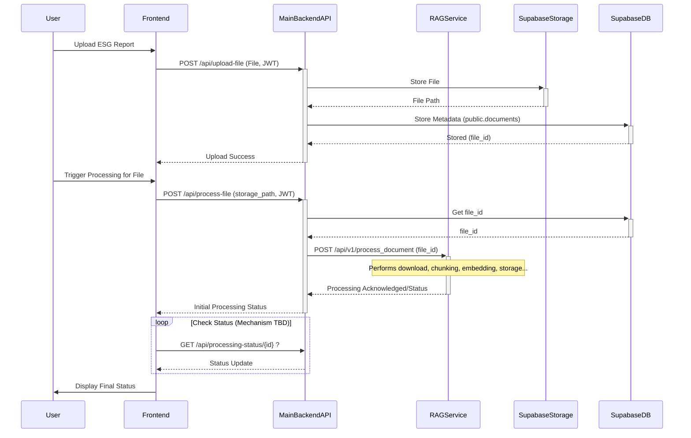
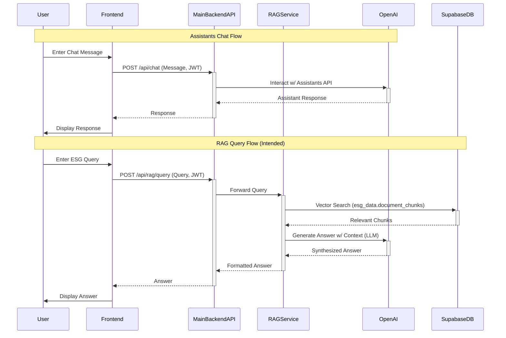

# Frontend Guide v2.0

**Based on Code Analysis (YYYY-MM-DD)** - *Replace with current date*

## Introduction

Our ESG Analytics Platform's frontend delivers an AI-powered interface for sustainable data management. Built with React/Next.js, it combines professional data visualization with intuitive document processing and conversational analytics. The frontend interacts with a distributed backend system (Main API + RAG Service) via RESTful APIs.

### High-Level Frontend Interaction

```mermaid
graph TD
    subgraph FrontendApp [Next.js / React]
        FE_Auth[Auth Module (Supabase Client)]
        FE_UI[UI Components (Tailwind/Headless)]
        FE_State[State Management (Context/Zustand)]
        FE_API[API Client (Fetch/Axios)]
        FE_Viz[Visualizations (Recharts/Apex)]
    end

    subgraph BackendSystem
        MainAPI[Main Backend API (Flask @5005)]
        RAGSvc[RAG Service (Flask @6050)]
    end

    subgraph ExternalServices
        SupabaseAuth[(Supabase Auth)]
        SupabaseDB[(Supabase DB)]
        SupabaseStore[(Supabase Storage)]
        OpenAI[(OpenAI API)]
    end

    FE_Auth --> SupabaseAuth
    FE_API --> MainAPI
    MainAPI -- Triggers --> RAGSvc
    MainAPI -- Interacts --> SupabaseStore
    MainAPI -- Interacts --> SupabaseDB
    MainAPI -- Interacts --> OpenAI
    RAGSvc -- Interacts --> SupabaseStore
    RAGSvc -- Interacts --> SupabaseDB
    RAGSvc -- Interacts --> OpenAI

    FE_UI & FE_State & FE_Viz -- Uses Data From --> FE_API
```

---

## Core Architecture

### Frontend Component Hierarchy (Conceptual)

```mermaid
flowchart TD
  A[ESG Platform (App)] --> B[Auth Handling (Login Page/Guard)]
  A --> C[Main Layout]
  C --> SB[Sidebar (Navigation, File Tree?)]
  C --> MA[Main Area]
  MA --> DW[Document Workspace]
  MA --> AH[Analytics Hub]
  MA --> CI[Chat Interface]

  DW --> Upload[Upload Interface]
  DW --> Viewer[Document Viewer/Browser]
  DW --> Status[Processing Status]

  AH --> Metrics[Metric Visualizations]
  AH --> Reports[Report Management]

  CI --> ChatInput[Chat Input]
  CI --> ChatDisplay[Chat Display]

```

### Technology Stack

| Layer            | Components                       |
| :--------------- | :------------------------------- |
| **UI Framework** | React 18, Next.js 14 (Assumed)   |
| **Styling**      | Tailwind CSS 3, Headless UI    |
| **State**        | Context API, Zustand (Assumed)   |
| **Charts**       | Recharts, ApexCharts (Assumed) |
| **Auth Client**  | Supabase Client JS Library       |
| **API Client**   | Fetch API / Axios (Assumed)    |

---

## Document Management System

### File Upload & Processing Flow

- **Upload**: User selects file(s) via the Upload Interface. The Frontend sends the file and JWT Auth Token to the Main Backend API (`POST /api/upload-file`).
- **Storage**: Main Backend stores the file in Supabase Storage and metadata in `public.documents`.
- **Trigger Processing**: User selects an uploaded file and initiates processing via the Frontend. Frontend calls the Main Backend API (`POST /api/process-file`) with the file's storage path and JWT.
- **Backend Orchestration**: Main Backend triggers the RAG Service (`POST /api/v1/process_document`) which handles the actual chunking, embedding, and storage in `esg_data.document_chunks`.
- **Status Update**: Frontend polls or receives status updates (mechanism TBD) regarding the processing progress initiated by the Main Backend/RAG Service.



### Key Frontend Components

1.  **Upload Interface**: Drag-n-drop, progress bars, error messages.
2.  **File/Document Browser**: Display files/folders listed via `GET /api/list-tree`, allow selection for processing/viewing/download (`GET /api/files/<id>/download`). Handles delete (`DELETE /api/delete`) and rename (`POST /api/rename`).
3.  **Processing Status Indicator**: Shows feedback on ongoing RAG processing.

---

## Analytics Dashboard

### Visualization Architecture

- Frontend components fetch data from Main Backend `/api/analytics/*` endpoints.
- Data might include:
    - Processed chunks (`/api/analytics/data-chunks`)
    - Extracted Excel metrics (`/api/analytics/excel-data`)
    - Other metrics, trends, benchmarks (requires backend implementation to populate these from DB/Neo4j).
- Frontend uses charting libraries (Recharts, ApexCharts) to render visualizations.

```mermaid
flowchart LR
  A[Main Backend API<br>/api/analytics/*] --> B[Frontend API Client]
  B --> C[State Management]
  C --> D[Dashboard Components]
  D --> E[Chart Libraries<br>(Recharts/Apex)]
  E --> F[Rendered Visualizations]

  style A fill:#e3f2fd,stroke:#2196f3
  style E fill:#ffd,stroke:#333
```

### Example Data Endpoints

- `GET /api/analytics/data-chunks?document_id=...`
- `GET /api/analytics/excel-data`
- (Other endpoints like `/metrics`, `/trends`, `/reports` exist but backend logic needs full implementation)

---

## AI Chat Interface

### Conversation Workflows

1.  **OpenAI Assistant Chat**:
    - User enters message in Chat UI.
    - Frontend sends message to Main Backend (`POST /api/chat`, JWT).
    - Main Backend interacts with OpenAI Assistants API, manages thread.
    - Main Backend returns assistant's response to Frontend.
    - Frontend displays response.
2.  **RAG Query (Intended Flow)**:
    - User enters ESG-specific query in Chat UI.
    - Frontend sends query to Main Backend (`POST /api/rag/query`, JWT).
    - Main Backend proxies query to RAG Service.
    - RAG Service performs vector search on `esg_data.document_chunks`, retrieves context, generates response (potentially using OpenAI LLM).
    - RAG Service returns response to Main Backend.
    - Main Backend returns response to Frontend.
    - Frontend displays ESG-specific answer.



### Authentication Context

- All requests from the Frontend to the Main Backend API must include the JWT obtained during login in the `Authorization: Bearer <token>` header.
- The Main Backend uses this token to authenticate the user and potentially enforce role-based access.

---

## Quality Assurance & Testing (Frontend Focus)

| Aspect          | Tools                 | Coverage Focus                          |
| :-------------- | :-------------------- | :-------------------------------------- |
| Unit Testing    | Jest, Testing Library | Components, Utils, State Logic        |
| E2E Testing     | Cypress               | Core User Flows (Login, Upload, View) |
| Performance     | Lighthouse            | Load Times, Responsiveness            |
| Accessibility   | axe-core              | WCAG 2.1 AA Compliance                |

---

*This guide outlines frontend interactions based on the analyzed backend architecture. Specific component implementations and state management details reside within the frontend codebase.*