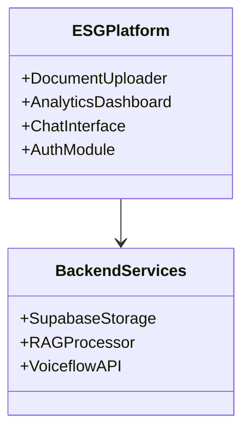
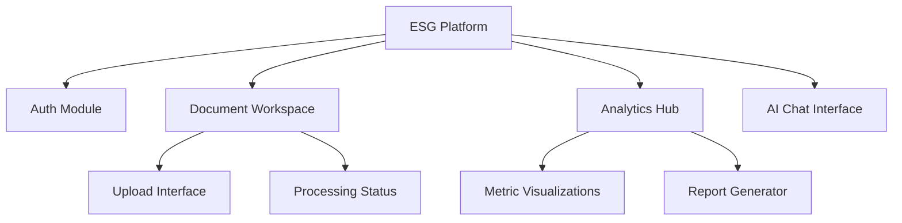
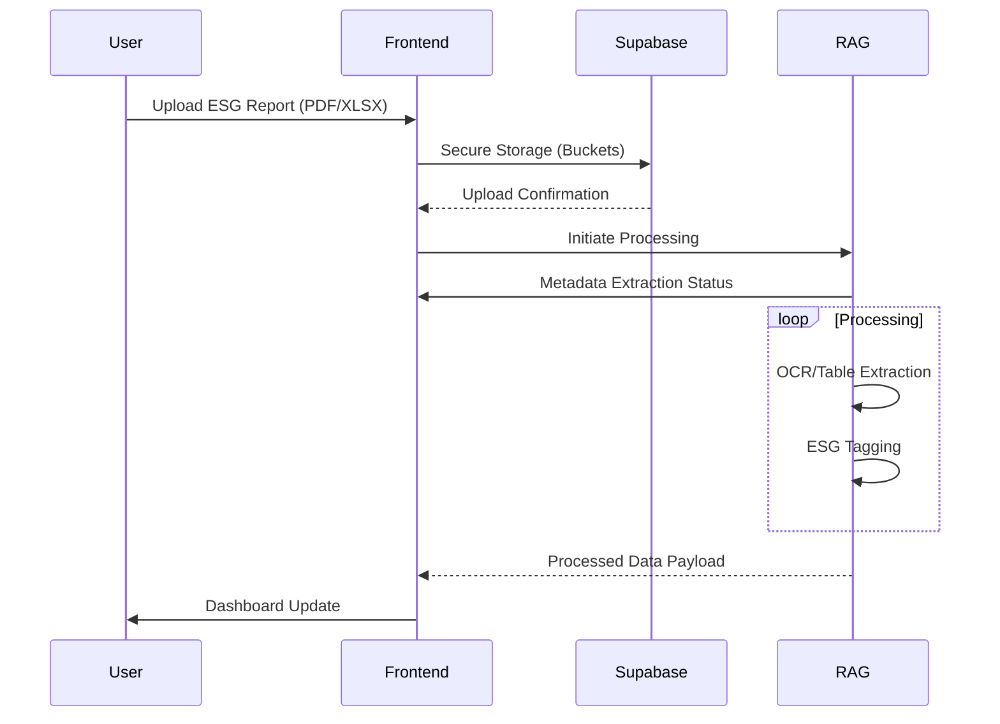
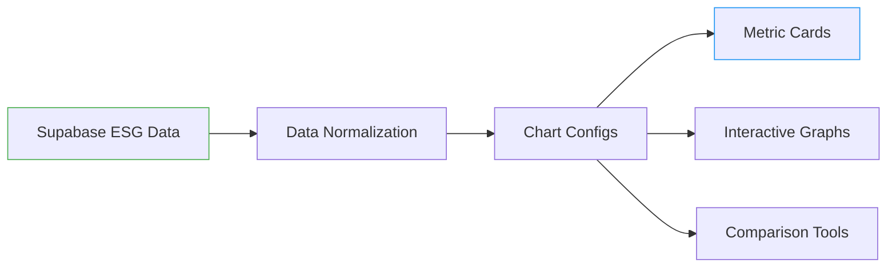
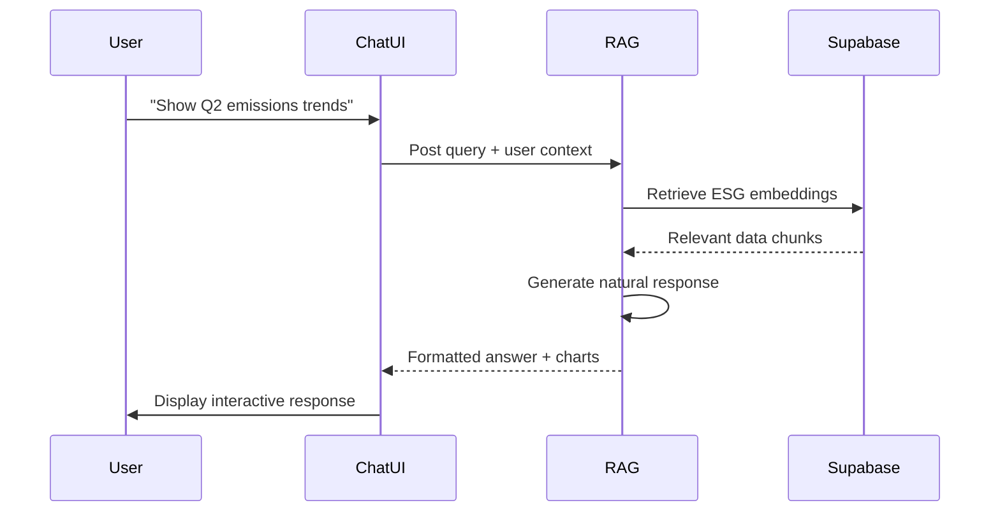
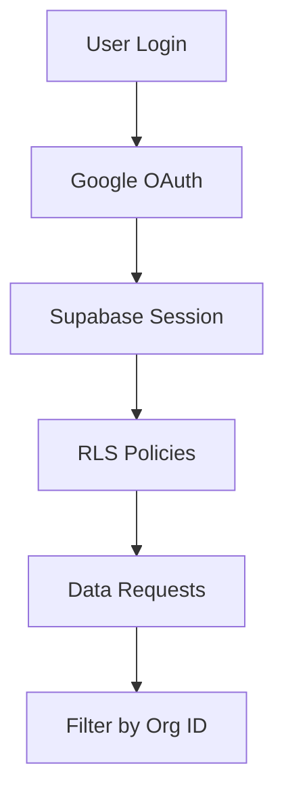
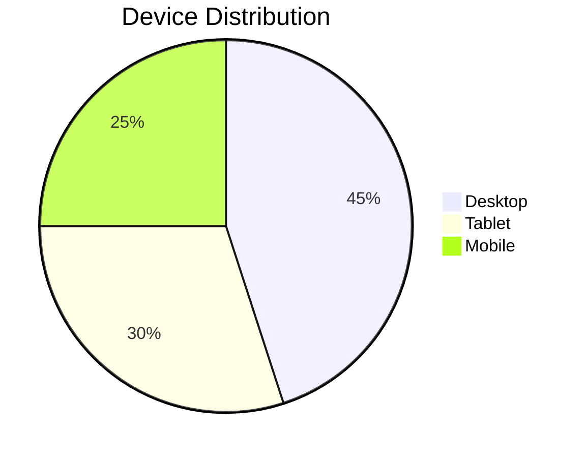
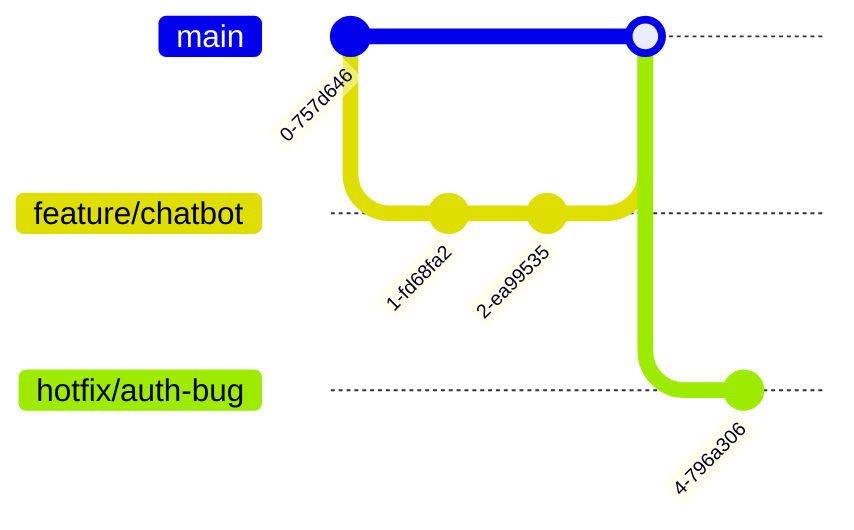

## Introduction

Our ESG Analytics Platform's frontend delivers an AI-powered interface for sustainable data management. Built with React/Next.js, it combines professional data visualization with intuitive document processing and conversational analytics. The system serves three core functions:

1. **Secure Document Management**: Multi-format uploads with real-time processing
2. **Interactive ESG Analytics**: Dynamic dashboards with AI-enhanced insights

---

## Core Architecture

### Component Hierarchy

### Technology Stack

| Layer | Components |
| --- | --- |
| **UI Framework** | React 18, Next.js 14 |
| **Styling** | Tailwind CSS 3, Headless UI |
| **State** | Context API, Zustand |
| **Charts** | Recharts, ApexCharts |
| **Auth** | Supabase Google OAuth |
| **AI** | Voiceflow Embed, OpenAI API |

---

## Document Management System

### File Processing Flow

### Key Components

1. **Upload Interface**
    - Drag-n-drop zone with format filtering
    - Real-time progress indicators
    - Error handling for invalid files
2. **Document Viewer**
    - Multi-tab layout for concurrent reviews
    - Side-by-side raw/processed data view
    - ESG metadata highlight system

---

## Analytics Dashboard

### Visualization Architecture

### Preconfigured ESG Metrics

| Category | Metrics | Visualization Type |
| --- | --- | --- |
| Environmental | Carbon Emissions | Time-series Area Chart |
| Social | Employee Diversity | Donut Chart |
| Governance | Board Independence | Horizontal Bar Chart |

---

## AI Chat Interface

### Conversation Workflow

### Security Integration

---

## Quality Assurance Matrix

| Aspect | Tools | Coverage |
| --- | --- | --- |
| Unit Testing | Jest, Testing Library | 85% Components |
| E2E Testing | Cypress | Core User Journeys |
| Performance | Lighthouse | 90+ Scores |
| Accessibility | axe-core | WCAG 2.1 AA |

---

## Responsive Design Specs

### Breakpoints

### Grid System

| Screen | Columns | Gutter |
| --- | --- | --- |
| >1280px | 12 | 32px |
| 768-1280 | 8 | 24px |
| <768 | 4 | 16px |

---

## Version Control

### Branch Strategy

This structured approach ensures maintainability while supporting rapid MVP iteration. All components follow atomic design principles for maximum reusability across ESG reporting scenarios.