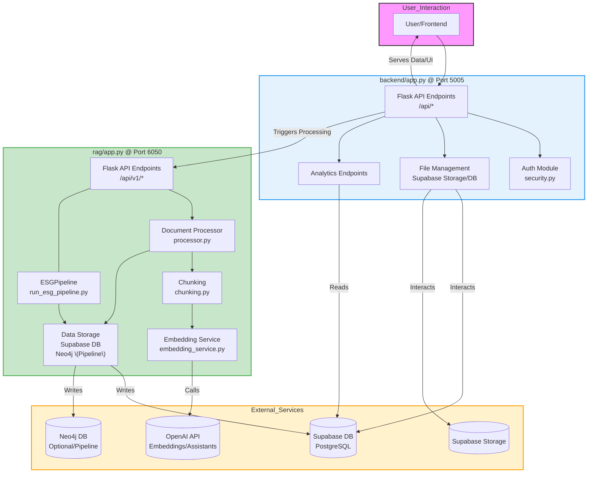

# Lean MVP Plan v2.0

**Based on Code Analysis (YYYY-MM-DD)** - *Replace with current date*

### **1. Vision & Goals**

- **Vision**: Revolutionize ESG reporting with a secure, AI-powered platform leveraging a two-service backend architecture for document processing, analytics, and report generation.
- **Key Goals**:
    - Implement robust data ingestion and processing via Main Backend and RAG Service.
    - Utilize Supabase (PostgreSQL, Storage) and Neo4j for efficient data management.
    - Provide secure, role-based access to data and features.
    - Deliver core analytics and reporting capabilities via API.

---

### **2. MVP Features (Aligned with Current Architecture)**

| **Category**          | **Features to Include**                                    | **Why?**                                       | **Key Components**                                                                                                  |
| :-------------------- | :--------------------------------------------------------- | :--------------------------------------------- | :------------------------------------------------------------------------------------------------------------------ |
| **Data Ingestion**    | - File uploads (PDF, Excel, CSV, DOCX) via Main Backend  | Ingest multiple source file types              | `backend/app.py` (`/api/upload-file`), Supabase Storage (`documents` bucket), `public.documents` table         |
| **File Management**   | - List/Create/Delete/Rename files & folders via Main API | Organize and manage uploaded documents         | `backend/app.py` (File Ops endpoints), Supabase Storage, `public.documents` table, RPC `manage_document_metadata` |
| **RAG Processing**    | - Trigger processing via Main Backend API                  | Initiate chunking & embedding                  | `backend/app.py` (`/api/process-file`)                                                                               |
|                       | - Chunking & Embedding via RAG Service                   | Convert raw files into searchable vectors      | `rag/app.py` (`/api/v1/process_document`), `processor.py`, `chunking.py`, `embedding_service.py`, OpenAI API   |
|                       | - Storage of chunks/embeddings in Supabase DB            | Persist processed data for querying            | `rag/app.py`, `supabase_storage.py`, `esg_data.document_chunks` table                                             |
| **Neo4j Pipeline**    | - (Advanced) Process files into Neo4j graph via RAG Service | Enable graph-based analysis                  | `rag/app.py` (`/api/v1/process-file`), `run_esg_pipeline.py`, Neo4j DB                                            |
| **ETL Processing**    | - (Implied) Extract structured data from Excel/CSV     | Store structured metrics                       | `backend/etl_*` dirs (assumed), `esg_data.excel_metrics` table                                                    |
| **Auth & Security**   | - JWT-based authentication (Main Backend)                  | Secure API access                              | `backend/security.py` (`@require_auth`, `@require_role`), Supabase Auth (Client-side integration assumed)        |
|                       | - Foundational RLS in Supabase                             | Control data access                            | Supabase RLS policies (examples in `security.py`)                                                                 |
| **Core Data APIs**    | - Retrieve document chunks                                 | Access processed data for UI/Analytics       | `backend/app.py` (`/api/analytics/data-chunks`, `/api/documents/<id>/chunks`)                                   |
|                       | - Retrieve extracted Excel data                            | Access structured metrics                      | `backend/app.py` (`/api/analytics/excel-data`)                                                                  |
| **Basic Chat**        | - Interact with OpenAI Assistant                           | Provide conversational interface             | `backend/app.py` (`/api/chat`), OpenAI Assistants API                                                             |

*Note: Many analytics and report generation endpoints (`/api/analytics/*`) exist but may require further implementation beyond retrieving basic chunks or Excel data.*

---

### **3. Core Components & Status**

| **Component**             | **Implementation Status**                                    | **Key Files/Services**                                                                              |
| :------------------------ | :----------------------------------------------------------- | :-------------------------------------------------------------------------------------------------- |
| **Main Backend API**      | Implemented (Flask)                                          | `backend/app.py`, `backend/security.py`                                                             |
| **RAG Service**           | Implemented (Flask)                                          | `rag/app.py`, `rag/processor.py`, `rag/embedding_service.py`, `rag/supabase_storage.py`           |
| **File Upload/Mgmt**    | Implemented                                                  | Main Backend API, Supabase Storage, `public.documents`                                              |
| **RAG Processing Flow** | Implemented (Main Backend trigger -> RAG Service execution)  | Main Backend API (`/api/process-file`), RAG Service API (`/api/v1/process_document`)                |
| **Embedding Generation**  | Implemented (via RAG Service)                                | `rag/embedding_service.py`, OpenAI API                                                              |
| **Chunk/Vector Storage**  | Implemented (Supabase PG)                                    | `rag/supabase_storage.py`, `esg_data.document_chunks`                                               |
| **Neo4j Pipeline**        | Implemented (within RAG Service)                             | `rag/run_esg_pipeline.py`, `rag/app.py` (`/api/v1/process-file`), Neo4j                             |
| **Structured ETL**        | Partially Implemented (DB table exists, code implied)        | `esg_data.excel_metrics`, `backend/etl_*` (assumed)                                                 |
| **Authentication (JWT)**  | Implemented (Backend validation)                             | `backend/security.py`                                                                               |
| **Authorization (Role)**  | Implemented                                                  | `backend/security.py`                                                                               |
| **RLS**                   | Foundational (Examples exist, requires policy application) | Supabase RLS feature, `security.py` (examples)                                                      |
| **Analytics/Reporting API** | Partially Implemented (Core data retrieval exists, others need implementation) | `backend/app.py` (`/api/analytics/*`)                                                             |
| **Chat API**              | Implemented                                                  | `backend/app.py` (`/api/chat`), OpenAI Assistants API                                                             |
| **Containerization**      | Implemented (Dockerfiles exist)                              | `backend/Dockerfile`, `rag/Dockerfile`                                                              |

---

### **4. Updated Timeline (Conceptual)**

*(This is a conceptual timeline based on architecture, actual progress may vary)*

| **Phase**          | **Focus**                                                 | **Key Components Involved**                                                                          |
| :----------------- | :-------------------------------------------------------- | :--------------------------------------------------------------------------------------------------- |
| **Foundation**     | - Service Setup (Flask Apps, Docker)                      | `backend/`, `rag/`, Dockerfiles                                                                        |
|                    | - Core Auth & File Management                             | `backend/app.py`, `security.py`, Supabase Storage, `public.documents`                                |
| **Core RAG**       | - RAG Service Implementation (Chunk, Embed, Store)        | `rag/app.py`, `processor.py`, `embedding_service.py`, OpenAI, `esg_data.document_chunks`          |
|                    | - Backend Trigger for RAG                                 | `backend/app.py` (`/api/process-file`), RAG Service (`/api/v1/process_document`)                   |
| **Advanced Data**  | - Neo4j Pipeline Implementation                           | `rag/run_esg_pipeline.py`, Neo4j                                                                     |
|                    | - Structured ETL Development                            | `backend/etl_*` (assumed), `esg_data.excel_metrics`                                                  |
| **API Exposure**   | - Implement Core Data Retrieval APIs                      | `backend/app.py` (e.g., `/api/analytics/data-chunks`, `/api/analytics/excel-data`)               |
|                    | - Implement Remaining Analytics/Reporting APIs            | `backend/app.py` (`/api/analytics/*`)                                                              |
| **Integration**    | - Frontend Integration with APIs                          | Frontend Framework (Next.js assumed), Main Backend API                                                 |
|                    | - Chat Integration                                        | Frontend, Main Backend API (`/api/chat`)                                                             |
| **Security/Ops**   | - Implement & Test RLS Policies                           | Supabase RLS                                                                                         |
|                    | - Setup Monitoring & Logging                              | Cloud Provider tools, Sentry (optional)                                                              |
|                    | - CI/CD & Deployment                                      | GitHub Actions (assumed), Docker Hub, Cloud Provider                                                 |

---

### **5. Architecture Diagram (Backend Focus)**

---

### **6. Key Areas for Development/Refinement**

1.  **Analytics/Reporting API Implementation**: Flesh out the logic for the analytics and report generation endpoints in `backend/app.py` to use the data stored in `esg_data.document_chunks` and `esg_data.excel_metrics`.
2.  **ETL Process Implementation**: Define and implement the ETL logic (likely in `backend/etl_*`) to populate `esg_data.excel_metrics` from uploaded spreadsheets/CSVs.
3.  **RAG Query Endpoint**: Implement the RAG query logic (likely in the RAG service, exposed via `/api/rag/query` proxy in the main backend) to perform semantic search over `esg_data.document_chunks`.
4.  **Neo4j Integration**: Fully leverage the Neo4j graph potentially built by the `ESGPipeline` for analytics or advanced RAG.
5.  **RLS Policy Application**: Define and apply specific RLS policies in Supabase based on user roles and organization structure.
6.  **JWT Signature Verification**: Enhance `backend/security.py` to perform full JWT signature verification against Supabase JWKS endpoint.
7.  **Error Handling & Monitoring**: Implement robust error handling across services and set up production monitoring/alerting.
8.  **Audit Logging**: Implement the `audit_logs` table population if required for compliance.

---

### **7. Workflow Summary (Revised)**

1.  **Upload**: User uploads file via Main Backend API -> File stored in Supabase Storage, metadata in `public.documents`.
2.  **Trigger Processing**: User initiates processing via Main Backend API (`/api/process-file`).
3.  **RAG Service Execution**: Main Backend calls RAG Service (`/api/v1/process_document`) -> RAG Service downloads file, chunks, generates embeddings (OpenAI), stores results in `esg_data.document_chunks`.
4.  **(Optional) ETL Execution**: Separate process (manual or triggered) reads Excel/CSV, extracts data, stores in `esg_data.excel_metrics`.
5.  **(Optional) Neo4j Pipeline**: RAG Service endpoint (`/api/v1/process-file`) runs `ESGPipeline`, populating Neo4j.
6.  **Data Retrieval**: Frontend/User calls Main Backend APIs (`/api/analytics/*`, `/api/rag/query`) to get processed data, metrics, or RAG results.
7.  **Chat**: User interacts via `/api/chat` endpoint, leveraging OpenAI Assistants.

---

*This plan reflects the current architecture identified in the codebase. Focus should be on implementing the remaining API logic and ensuring robust integration between the services.*