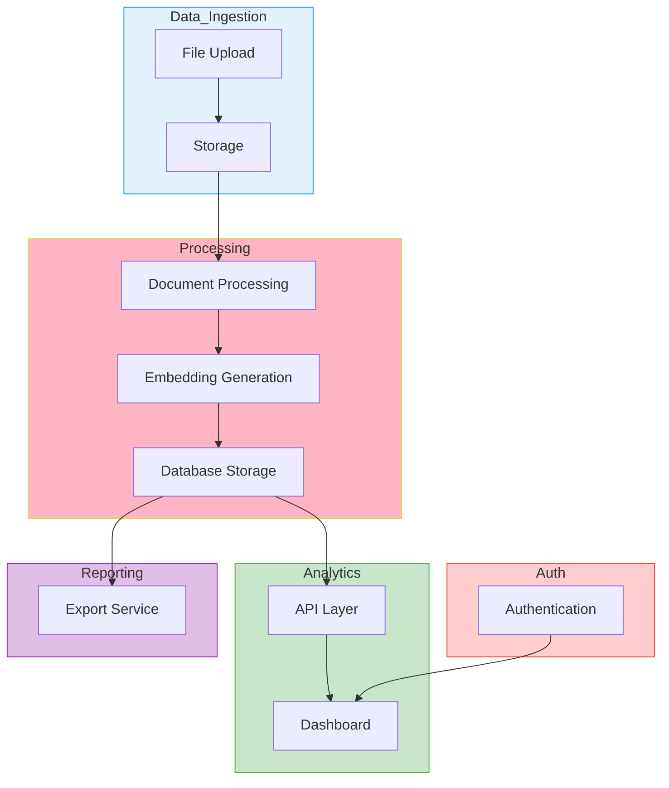
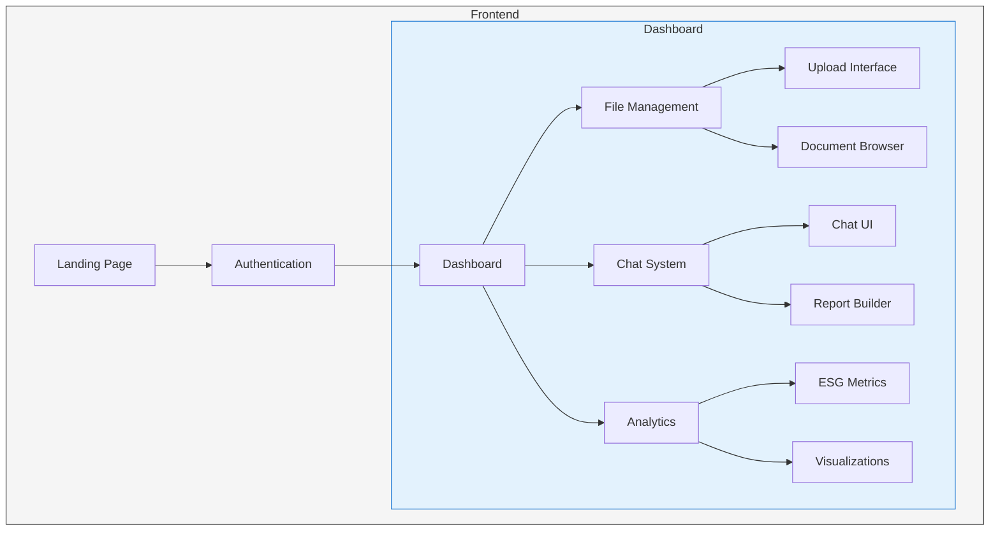

### **1. Vision & Goals**

- **Vision**: Revolutionize ESG reporting with a secure, AI-powered platform for document processing, analytics, and report generation.
- **Key Enhancements**:
    - Full ESG framework integration.
    - Robust security and compliance features.
    - Scalable architecture with clear error handling.
    - Enhanced UI/UX for reporting and analytics.

---

### **2. MVP Features (Must-Have)**

| **Category** | **Features to Include** | **Why?** | **Tools/Components** |
| --- | --- | --- | --- |
| **Data Ingestion** | - Upload for PDF, Excel, CSV, DOCX
- Dual pipeline for structured/unstructured data | Ingest multiple file types with ESG metadata tagging | Simba (Inspiration): Next.js UI, Custom Supabase Storage, document_processor.py |
| **File Management** | - Hierarchical folder structure
- Automatic/manual tagging | Organize files by project and enhance RAG search | SaaS Factory's Document Processor (extended for all formats) |
| **Basic Processing** | - Text extraction and chunking with ESG tags
- OpenAI embeddings generation | Convert raw files into searchable, ESG-tagged chunks | embedding_service.py, chunking functions, Tesseract OCR, Camelot integration |
| **User Interface** | - Dashboard with ESG metrics and visualizations
- Enhanced reporting UI/UX | Present data clearly and enable interactive insights | Next.js dashboard, SaaS Factory chart components, DocumentUploader UI |
| **Auth & Security** | - Google OAuth login/signup
- Row-level security for ESG data | Secure access and data privacy | Supabase Auth (Google OAuth), row-level security policies |
| **Output Generation** | - Export reports in Excel/PDF
- Reporting from normalized (dual stored) data | Generate offline reports from ESG data | Pandas, WeasyPrint, openpyxl |
| **Audit & Logging** | - Comprehensive logging of key user/system events
- Activity dashboard with export | Enhance transparency, security, and compliance | Supabase logging, custom Next.js dashboard components |

---

### **3. Reusable Components (Updated)**

| **Component** | **What We Can Use** | **What's Missing** |
| --- | --- | --- |
| **Core RAG** | - Document processor (PyPDF2/LangChain)
- OpenAI embeddings service | - ESG framework metadata tagging
- Excel/CSV/DOCX parsers |
| **Authentication** | Supabase Google OAuth flow | Row-level security policies for ESG data |
| **Basic Processing** | Text chunking pipeline
Vector storage implementation | Dual storage system (structured + unstructured) |
| **Chatbot Foundation** | API endpoint structure
OpenAI response generation | ESG-specific prompt engineering |

---

### **4. Updated Timeline**

| **Month** | **Week** | **Tasks** |
| --- | --- | --- |
| **Month 1** | Week 1 | **Initial Setup & Data Pipeline**- Development environment setup
- File ingestion integration
- Basic PDF processing
- Initial unit testing |
|  | Week 2 | **File Processing & ESG Integration**- Excel/CSV/DOCX parsing implementation
- ESG metadata tagging system
- Document processor testing
- Error handling |
|  | Week 3 | **Dashboard & Authentication**- Next.js dashboard setup
- Basic charts implementation
- Supabase Auth integration
- Google OAuth setup |
|  | Week 4 | **Core Features**- RAG pipeline configuration
- Chatbot integration
- API endpoint development
- Security implementation |
| **Month 2** | Week 5 | **Reporting, Export & Audit Logging**- Excel/PDF export functionality
- WeasyPrint integration                                                      - ChatGPT Canvas type UI Interface
- Develop Audit Trail & Activity Logging module |
|  | Week 6 | **Testing & Optimization**- Database tuning
- End-to-end testing
- Bug fixes
- Audit log testing & performance review |
|  | Week 7 | **Development Prep**- CI/CD pipeline setup
- Staging environment
- Pre-deployment testing |
|  | Week 8 | **Launch & Support**- Production deployment
- Monitoring setup
- Final testing
- Support system setup |

---

### **5. Architecture Diagrams**

### **Backend Architecture**

### **Frontend Architecture**

---

### **6. Key Improvements**

### **1. ESG Framework Integration**

- Add ESG metadata tagging and framework mapping logic to the document processor.
- Ensure compliance with major ESG standards (e.g., GRI, SASB).

### **2. Dual Pipeline Synchronization**

- Develop a unified normalization pipeline for structured/unstructured data.
- Test synchronization between pipelines to avoid duplication.

### **3. Enhanced Security**

- Implement row-level security policies for ESG data.
- Conduct penetration testing to identify vulnerabilities.

### **4. File Processing Validation**

- Test Excel/CSV/DOCX parsers with edge cases.
- Validate OCR tools (Tesseract, Camelot) for non-PDF content.

### **5. UI/UX Enhancements**

- Add the improved reporting UI/UX (renamed sidebar, regenerate document feature).
- Include a "+ Custom Document" button for new uploads.

### **6. Audit Logging**

- Develop a comprehensive Audit Trail & Activity Logging module.
- Ensure logs are stored securely and can be exported for compliance reviews.

### **7. Compliance & Data Privacy**

- Address GDPR and other regulatory requirements (e.g., data residency, user consent).
- Document compliance measures in the user agreement.

### **8. Error Handling**

- Add retry mechanisms for failed uploads.
- Notify users of errors and provide actionable steps.

### **9. Scalability**

- Optimize database performance for large volumes of ESG data.
- Plan for scaling the self-hosted file management system.

---

### **7. Workflow Summary**

1. **File Upload**: Users upload ESG-related files (PDF/Excel/CSV/DOCX) to Supabase Storage.
2. **Processing**: Files are processed (extracted, enhanced, and converted into embeddings).
3. **Storage**: Data is stored in Supabase DB (esg_metrics & esg_chunks).
4. **Analytics**: Data is visualized in the Next.js dashboard or queried via the chatbot.
5. **Reporting**: Users can export reports in Excel/PDF with improved UI/UX.
6. **Audit Logging**: All actions are logged for transparency and compliance.

---

### **8. Additional Functional Modules**

### **Upload Documents**

- Support major formats (XLSX, DOCX, PDF, XML, CSV).
- Enable automatic/manual tagging for RAG search.

### **Chat**

- Query the database and generate reports via the chatbot.
- Add context through tags for accurate RAG querying.

### **Dashboard**

- Display analyzed data with interactive charts.
- Incorporate a sidebar for grouped documents and actions (copy, download).

### **Baseline Logic**

- Allow users to select multiple data sources for specific framework reports.
- Ensure documents complement each other for comprehensive reporting.

---

### **9. Key Observations (Integrated Improvements)**

1. **Sidebar (Left Panel)**:
    - Rename "Steps" to "Available Documents."
    - Include "+ Custom Document" for new uploads.
2. **Main Content Area (Right Panel)**:
    - Display document contents with professional formatting.
    - Include sections like Non-Functional Requirements, Constraints & Assumptions, and Known Issues.
3. **Bottom Panel**:
    - Add a "Regenerate Document" feature for modifications.
4. **Action Buttons**:
    - Provide options to copy, download, or download all documents.

---

### **10. New Feature: Audit Trail & Activity Logging**

- **Comprehensive Logging**: Track uploads, edits, downloads, and authentication events.
- **Activity Dashboard**: Enable filtering and search based on date, user, or event type.
- **Compliance & Security**: Support ESG reporting standards and regulatory requirements.
- **Integration**: Seamlessly integrate with Supabase and the existing backend.