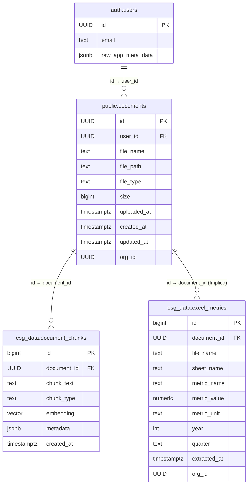

# Database Schema Design v2.0

**Based on Code Analysis (YYYY-MM-DD)** - *Replace with current date*

## Introduction

This document outlines the **database schema, data models, and relationships** for the AI-powered ESG Data Management & Analytics System, updated based on codebase analysis. The design primarily leverages **Supabase PostgreSQL** for structured storage and metadata management, and **Supabase Storage** for raw file persistence. Additionally, a **Neo4j graph database** is utilized by the RAG service for advanced data representation and analysis.

---

## Database Overview

### Primary Database (Supabase PostgreSQL)

- **Purpose**: Store document metadata, processed text chunks with embeddings, and structured metrics extracted from files.
- **Key Schemas Used**: `public`, `esg_data`.
- **Key Use Cases**:
    - Storing metadata about uploaded files and folders.
    - Storing processed text chunks and vector embeddings for RAG.
    - Storing structured data extracted via ETL processes.
    - Row-level security (RLS) for data access control.

### Graph Database (Neo4j - via RAG Service)

- **Purpose**: Store ESG data as a knowledge graph for complex relationship analysis and potentially advanced RAG queries.
- **Populated By**: The `ESGPipeline` within the RAG service (`rag/run_esg_pipeline.py`).
- **Key Use Cases**:
    - Representing entities (companies, metrics, topics) and their relationships.
    - Graph-based querying and analytics.

### File Storage (Supabase Storage)

- **Purpose**: Store the raw uploaded document files (PDF, DOCX, XLSX, CSV, etc.).
- **Bucket Used**: `documents`.
- **Key Use Cases**:
    - Persistence of original source files.
    - Retrieval of files for processing by the RAG service or for user download.

*(Note: Redis was mentioned in the previous schema document for vector caching but was only observed being used for OpenAI Assistant thread IDs in the current codebase.)*

---

## Key Supabase PostgreSQL Tables

### 1. `public.documents`

- **Purpose**: Stores metadata about every file and folder uploaded or created in Supabase Storage.
- **Management**: Primarily managed by the Main Backend (`backend/app.py`) via the `manage_document_metadata` RPC function.
- **Observed/Inferred Fields**:
    - `id` (UUID) [PK] - Auto-generated by Supabase?
    - `user_id` (UUID) → References `auth.users.id` (Passed to RPC)
    - `file_name` (TEXT/VARCHAR)
    - `file_path` (TEXT/VARCHAR) [Unique?] → Path in Supabase Storage, used as identifier in some API calls.
    - `file_type` (TEXT/VARCHAR) → Mimetype or 'folder'.
    - `size` (BIGINT/INTEGER) → File size in bytes (0 for folders).
    - `uploaded_at` (TIMESTAMPTZ)
    - `created_at` (TIMESTAMPTZ) - Auto?
    - `updated_at` (TIMESTAMPTZ) - Auto?
    - *(Potential/Implied)*: `org_id` (UUID) → For RLS, mentioned in `security.py` examples.

### 2. `esg_data.document_chunks`

- **Purpose**: Store processed text chunks and their corresponding vector embeddings, linking back to the original document.
- **Management**: Populated by the RAG Service (`rag/app.py` -> `store_chunks`).
- **Observed/Inferred Fields**:
    - `id` (BIGINT/SERIAL) [PK]
    - `document_id` (UUID) → References `public.documents.id`.
    - `chunk_text` (TEXT)
    - `chunk_type` (TEXT/VARCHAR) → e.g., 'text', 'table', 'title'.
    - `embedding` (VECTOR) → Vector embedding from OpenAI.
    - `metadata` (JSONB) → Could store source page, chunk index, etc.
    - `created_at` (TIMESTAMPTZ) - Auto?
    - `chunk_id` (UUID?) → A separate identifier for the chunk itself?

### 3. `esg_data.excel_metrics`

- **Purpose**: Store structured data extracted from Excel or CSV files via ETL processes.
- **Management**: Populated by ETL processes (location TBD, potentially `backend/etl_*`). Queried by Main Backend (`/api/analytics/excel-data`).
- **Observed Fields**:
    - `id` (BIGINT/SERIAL) [PK]
    - `file_name` (TEXT/VARCHAR)
    - `sheet_name` (TEXT/VARCHAR)
    - `metric_name` (TEXT/VARCHAR)
    - `metric_value` (FLOAT/NUMERIC)
    - `metric_unit` (TEXT/VARCHAR)
    - `year` (INTEGER)
    - `quarter` (TEXT/VARCHAR)
    - `extracted_at` (TIMESTAMPTZ)
    - *(Potential/Implied)*: `document_id` (UUID) → To link back to the source file in `public.documents`.
    - *(Potential/Implied)*: `org_id` (UUID) → For RLS.

### 4. `auth.users` (Built-in Supabase Table)

- **Purpose**: Managed by Supabase Auth for user authentication details.
- **Key Fields Used by Backend**:
    - `id` (UUID) [PK]
    - `email` (TEXT)
    - `raw_app_meta_data` (JSONB) → Contains custom metadata like `role`.

*(Note: Tables like `esg_metrics` (as previously designed), `frameworks`, and `audit_logs` were not observed being actively used in the analyzed code paths and are omitted here. They may represent planned future features.)*

---

## Neo4j Graph Schema (Conceptual)

- **Purpose**: Represent ESG data as a knowledge graph within the RAG service's `ESGPipeline`.
- **Management**: Populated by `rag/run_esg_pipeline.py` and potentially other scripts in `rag/` like `import_graph.py`, `build_esg_graph.py`.
- **Conceptual Nodes/Labels** (Based on filenames like `entity_extraction.py`, `claim_extraction.py`):
    - `Document`: Represents source documents.
    - `Chunk`: Represents text chunks from documents.
    - `Entity`: Represents named entities (e.g., Companies, Locations, Persons, Metrics).
    - `Claim`: Represents extracted assertions or statements related to ESG.
    - `Topic`: Represents key themes or subjects.
    - `Metric`: Represents specific ESG data points.
- **Conceptual Relationships**:
    - `HAS_CHUNK`: (Document)-[:HAS_CHUNK]->(Chunk)
    - `MENTIONS`: (Chunk)-[:MENTIONS]->(Entity)
    - `CONTAINS`: (Chunk)-[:CONTAINS]->(Claim)
    - `RELATED_TO`: (Entity)-[:RELATED_TO]->(Entity)
    - `HAS_METRIC`: (Entity)-[:HAS_METRIC]->(Metric)
    - `PART_OF`: (Claim)-[:PART_OF]->(Topic)

*(Note: The exact Neo4j schema requires deeper analysis of the RAG service pipeline code, specifically `run_esg_pipeline.py` and related graph scripts.)*

---

## Relationships (PostgreSQL Focus)

### Entity Relationship Diagram (Conceptual - PostgreSQL Only)

### Key Relationships (PostgreSQL)

1.  **Document to Chunks**: `esg_data.document_chunks.document_id` references `public.documents.id`, linking processed chunks back to their source file metadata.
2.  **Document to Excel Metrics (Implied)**: `esg_data.excel_metrics` likely requires a `document_id` FK referencing `public.documents.id` to link extracted structured data back to its source file (needs confirmation/implementation).
3.  **User Ownership**: `public.documents.user_id` references `auth.users.id`, indicating which user uploaded the file.
4.  **RLS Link (Implied)**: Both `public.documents` and `esg_data.excel_metrics` would likely need an `org_id` field linked to a user/organization mapping table to implement organization-based Row-Level Security as suggested in `security.py`.

---

## Indexing & Optimization (PostgreSQL)

### Key Indexes (Recommended/Observed)

1.  **Vector Index on Embeddings (`esg_data.document_chunks`)**:
    - Essential for efficient RAG similarity searches.
    - Example (using pgvector): `CREATE INDEX ON esg_data.document_chunks USING ivfflat (embedding vector_cosine_ops);` (or HNSW for newer pgvector versions).
2.  **Foreign Key Indexes**: Indexes on FK columns (`document_id`, `user_id`) are crucial for join performance.
    - `CREATE INDEX ON esg_data.document_chunks (document_id);`
    - `CREATE INDEX ON public.documents (user_id);`
    - `CREATE INDEX ON esg_data.excel_metrics (document_id);` (if FK is added)
3.  **Query-Specific Indexes**: Indexes on fields frequently used in WHERE clauses or JOINs (e.g., `public.documents.file_path`, `public.documents.org_id`, `esg_data.excel_metrics.year`).
    - `CREATE INDEX ON public.documents (file_path);`

### Full-Text Search (Optional)

- If needed, FTS can be added to `esg_data.document_chunks.chunk_text` using `tsvector` columns and GIN indexes for keyword searching alongside vector search.

---

## Security & Compliance

1.  **Row-Level Security (RLS)**:
    - Should be enabled on tables containing sensitive or organization-specific data (`public.documents`, `esg_data.document_chunks`, `esg_data.excel_metrics`).
    - Policies should use `auth.uid()` and potentially an `org_id` mapped from the user's profile or a dedicated membership table to restrict access.
    - Example from `security.py`: `CREATE POLICY "Org Read Access" ON public.documents FOR SELECT USING (org_id = (SELECT org_id FROM user_profiles WHERE user_id = auth.uid()));` (Requires `user_profiles` table with `org_id`).
2.  **RPC Function Security**: Ensure the `manage_document_metadata` function has appropriate security definitions (`SECURITY DEFINER` or `SECURITY INVOKER`) based on whether it needs elevated privileges or should run as the calling user.
3.  **Data Encryption**: Relies on Supabase's built-in encryption at rest and standard TLS for data in transit.

---

*This document reflects the state of the codebase and database interactions as analyzed. Specific field types, constraints, and the exact Neo4j schema require further verification.*
