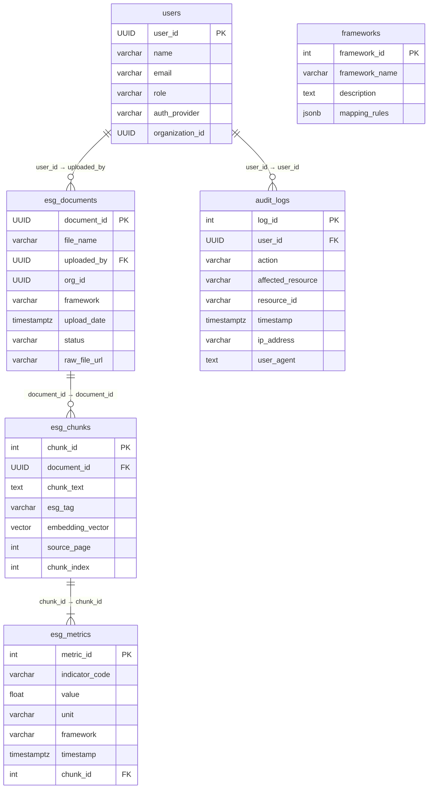
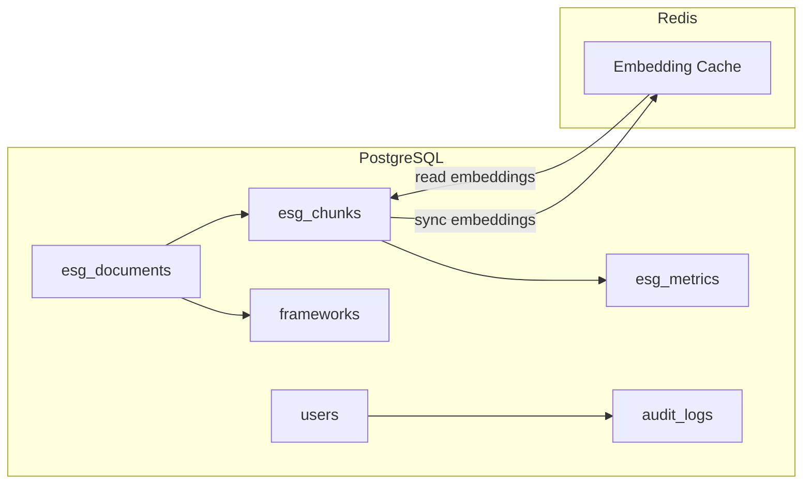

## Introduction

This document outlines the **revised database schema, data models, and relationships** for an AI-powered ESG Data Management & Analytics System. The design leverages **Supabase PostgreSQL** for structured storage and **Redis** for fast in-memory caching of vector data, supporting accelerated retrieval in RAG (Retrieval-Augmented Generation) queries. The schema prioritizes security, performance, traceability, and maintainability.

---

## Database Overview

### Primary Database (Supabase PostgreSQL)

- **Purpose**: Store structured ESG data, document metadata, and processed insights.
- **Type**: Relational DB
- **Key Use Cases**:
    - Complex ESG queries and analytics
    - Detailed metadata about documents, metrics, and users
    - Row-level security (RLS) for multi-tenant or organizational separation

### Secondary Storage (Redis)

- **Purpose**: Cache AI embeddings and vector data.
- **Type**: In-memory key-value store
- **Key Use Cases**:
    - Low-latency retrieval of embedding vectors for real-time query responses
    - Temporary storage to bridge on-disk data (PostgreSQL) with in-memory computations

---

## Key Tables

### 1. esg_documents

- **Purpose**: Store metadata, processing status, and raw file references for uploaded documents.
- **Fields**:
    - `document_id` (UUID) [PK]
    - `file_name` (VARCHAR(255))
    - `uploaded_by` (UUID) → References `users.user_id`
    - `org_id` (UUID) → Organization-level security
    - `framework` (VARCHAR(50)) → e.g., "GRI", "SASB", "TCFD"
    - `upload_date` (TIMESTAMPTZ)
    - `status` (VARCHAR(20)) → CHECK in ["pending", "processed", "error"]
    - `raw_file_url` (VARCHAR(255)) → Location in Supabase Storage

### 2. esg_chunks

- **Purpose**: Store processed text chunks, ESG metadata, and AI embeddings.
- **Fields**:
    - `chunk_id` (SERIAL) [PK]
    - `document_id` (UUID) → References `esg_documents.document_id`
    - `chunk_text` (TEXT)
    - `esg_tag` (VARCHAR(100)) → e.g., "emissions", "diversity"
    - `embedding_vector` (VECTOR(1536)) → For OpenAI embeddings
    - `source_page` (INT)
    - `chunk_index` (INT)

### 3. esg_metrics

- **Purpose**: Store standardized ESG metrics mapped to sustainability frameworks.
- **Fields**:
    - `metric_id` (SERIAL) [PK]
    - `indicator_code` (VARCHAR(50)) → e.g., "GRI-305", "SASB-E1"
    - `value` (FLOAT)
    - `unit` (VARCHAR(20)) → e.g., "tonnes CO2e", "%"
    - `framework` (VARCHAR(50)) → e.g., "GRI", "SASB"
    - `timestamp` (TIMESTAMPTZ)
    - `chunk_id` (INT) → References `esg_chunks.chunk_id`

### 4. frameworks (New Table)

- **Purpose**: Centralize the definitions and mapping rules for ESG frameworks.
- **Fields**:
    - `framework_id` (SERIAL) [PK]
    - `framework_name` (VARCHAR(50)) → e.g., "GRI", "SASB", "TCFD"
    - `description` (TEXT)
    - `mapping_rules` (JSONB)

### 5. users

- **Purpose**: Manage user authentication and access roles.
- **Fields**:
    - `user_id` (UUID) [PK] → Managed by Supabase Auth
    - `name` (VARCHAR(100))
    - `email` (VARCHAR(255))
    - `role` (VARCHAR(20)) → CHECK in ["admin", "esg_manager", "analyst", "viewer"]
    - `auth_provider` (VARCHAR(50)) → e.g., "google"
    - `organization_id` (UUID)

### 6. audit_logs

- **Purpose**: Record user actions and system events.
- **Fields**:
    - `log_id` (SERIAL) [PK]
    - `user_id` (UUID) → References `users.user_id`
    - `action` (VARCHAR(100)) → e.g., "file_upload", "metric_edit"
    - `affected_resource` (VARCHAR(50)) → e.g., "esg_documents", "esg_metrics"
    - `resource_id` (VARCHAR(50)) → Resource primary key (UUID or INT)
    - `timestamp` (TIMESTAMPTZ)
    - `ip_address` (VARCHAR(45)) → For security auditing
    - `user_agent` (TEXT)

---

## Relationships

### Entity Relationship Diagram



### Relationship Highlights

1. **Document Processing**
    - `esg_chunks.document_id` → `esg_documents.document_id`
    - `esg_metrics.chunk_id` → `esg_chunks.chunk_id`
    (Each metric is traced back to a source chunk and, ultimately, to the parent document.)
2. **User Context & Access Control**
    - `esg_documents.org_id` can be validated against `users.organization_id` for RLS.
    - `audit_logs.user_id` references `users.user_id` to link actions to specific users.
3. **Framework Mapping**
    - `frameworks.framework_id` is separate from references in `esg_documents.framework` or `esg_metrics.framework`.
    (Additional foreign key constraints or triggers may be used to ensure valid framework entries; [Missing Information] if strict enforcement is desired.)

---

## Indexing & Optimization

### Performance Indexes

1. **Vector Index on Embeddings**
    
    ```sql
    CREATE INDEX idx_esg_chunks_embedding
    ON esg_chunks USING ivfflat (embedding_vector vector_cosine_ops);
    
    ```
    
    - Allows efficient approximate nearest-neighbor searches.
2. **Organization & Framework Index**
    
    ```sql
    CREATE INDEX idx_esg_documents_org
    ON esg_documents (org_id, framework);
    
    CREATE INDEX idx_esg_metrics_framework
    ON esg_metrics (framework, indicator_code);
    
    ```
    

### Full-Text Search

1. **Search Vector Column**
    
    ```sql
    ALTER TABLE esg_chunks
    ADD COLUMN search_vector TSVECTOR;
    
    ```
    
2. **GIN Index for Text Search**
    
    ```sql
    CREATE INDEX idx_fts_chunk_text
    ON esg_chunks USING gin(search_vector);
    
    ```
    

### Index Monitoring & Maintenance

- Use **pg_stat_user_indexes** for performance monitoring.
- Schedule index maintenance (e.g., **REINDEX**, **VACUUM**) during off-peak hours.

---

## Security & Compliance

1. **Row-Level Security (RLS)**
    
    ```sql
    CREATE POLICY "Org Access" ON esg_documents
    USING (org_id = current_setting('app.current_org_id')::UUID);
    
    ```
    
    - [Missing Information]: Additional policies for `esg_chunks` or `esg_metrics` if needed.
2. **Encryption**
    - **At Rest**: Implement AES-256 or pgcrypto for sensitive fields (e.g., `users.email`).
    - **In Transit**: Ensure Supabase connections use TLS 1.3 or higher.
3. **Backup & Recovery**
    - **Automated Backups**: Daily backups to AWS S3 (or equivalent).
    - **PITR**: Recommended for production resilience.

---

## Dual Storage Clarification

- **Supabase PostgreSQL**:
    - Holds all primary data structures (documents, chunks, metrics, users, logs).
    - Designed for structured queries, RLS, and long-term data retention.
- **Redis**:
    - Caches embedding vectors in memory for rapid RAG queries.
    - Serves as a transient layer; typically, embeddings are written back to PostgreSQL for permanent storage or indexing.



---

## Conclusion

This schema design integrates with the MVP technical stack (Supabase for relational data, Redis for in-memory caching) and provides:

- **Clear separation** between raw documents and processed ESG data.
- **Dedicated frameworks table** for robust ESG framework mapping.
- **Secure logging** for compliance and audit trails.
- **Indices** tailored for performance (vector searches, text search, and standard queries).

As the system evolves, additional constraints (e.g., foreign keys to `frameworks` table, advanced RLS policies) can be incrementally introduced to maintain data integrity and security.
